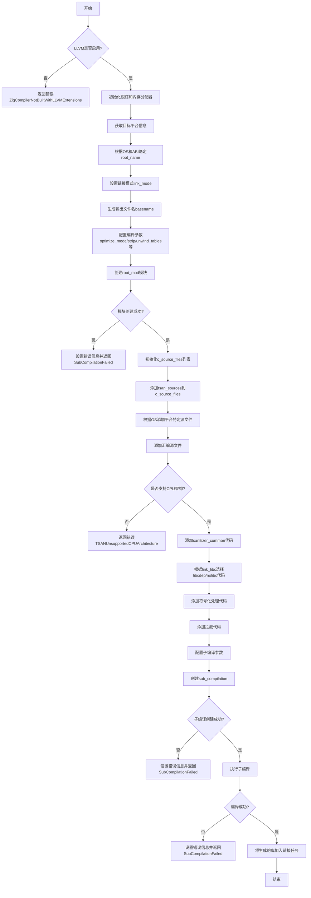

好的，我需要为给定的Zig函数`buildTsan`绘制一个流程图。首先，我要仔细阅读代码，理解每个步骤的作用，然后将这些步骤转化为流程图中的节点和判断分支。

首先，函数开始检查`build_options.have_llvm`，如果未启用LLVM扩展，则返回错误。接下来，初始化一些跟踪和内存分配器，获取目标平台信息，并根据不同操作系统和ABI确定根名称`root_name`。然后，根据目标平台设置链接模式`link_mode`，生成输出文件名`basename`。

接着，处理各种配置参数，如优化模式、strip选项、展开表设置等。创建模块`root_mod`，并处理各种源文件，包括平台特定的源文件、汇编源文件、公共sanitizer代码、符号化处理代码和拦截代码等。每个源文件都会添加相应的编译标志，并加入到`c_source_files`列表中。

然后，配置子编译`sub_compilation`，处理链接器相关选项，如安装名称、headerpad大小等。最后，执行子编译，处理可能的错误，并将生成的库文件加入主编译的链接任务中。

在这个过程中，需要注意条件判断，例如不同操作系统的处理、是否链接libc等。此外，错误处理部分需要单独的分支，例如在创建模块或子编译失败时，设置错误信息并返回。

现在需要将这些步骤组织成流程图，使用mermaid的语法。每个主要步骤作为一个节点，条件判断作为菱形分支，错误处理作为单独的分支。确保流程的逻辑顺序正确，分支清晰。
================================================
