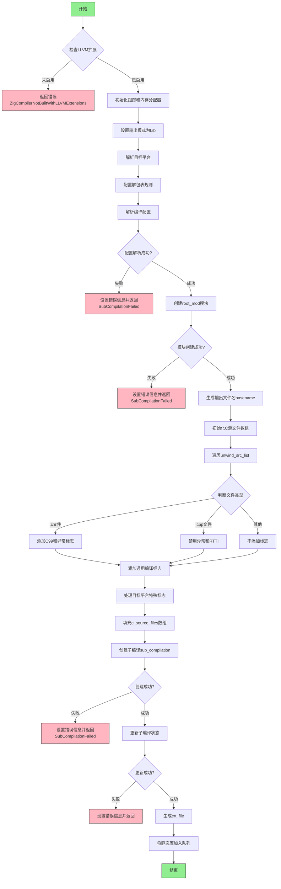

好的，我需要为给定的Zig函数`buildStaticLib`绘制一个流程图。首先，我得通读代码，理解每个步骤的作用和逻辑流程。

函数一开始检查是否启用了LLVM扩展，如果没有，就返回错误。接着初始化跟踪和内存分配器，设置输出模式和目标平台。然后处理一些配置，包括解包表（unwind tables）的设置。如果配置解析失败，会设置错误信息并返回。

接下来创建根模块（root_mod），如果失败同样处理错误。然后生成输出文件名，准备C源文件列表，根据文件扩展名添加不同的编译标志。这里有很多条件判断，比如针对不同目标平台添加特定标志，处理调试模式、多线程、ARM架构等。

之后创建子编译（sub_compilation），处理可能的错误，并最终将生成的静态库添加到编译队列中。整个过程涉及多个错误处理点，需要将这些分支都体现在流程图中。

需要注意各个步骤之间的依赖关系，比如配置必须在创建模块之前完成，而模块创建又必须在处理源文件之前。错误处理部分需要单独的分支，每个错误情况都应该有对应的流程节点。

在绘制流程图时，使用矩形框表示操作步骤，菱形框表示条件判断，箭头表示流程方向。需要确保所有可能的路径都被覆盖，包括正常流程和各个错误返回点。此外，初始化资源和后续的资源释放（如`defer`语句）也需要适当体现，可能在流程图中用单独的步骤表示。

最后，验证整个流程图是否准确反映了函数的执行顺序和逻辑结构，确保没有遗漏关键步骤或错误处理。
================================================
