好的，我需要为提供的Zig函数`doTask`绘制一个流程图。首先，我会仔细阅读代码，理解其结构和逻辑。

函数`doTask`接受一个`comp`指针、`tid`和`task`作为参数，返回`void`。主要的逻辑在`switch (task)`语句中，根据不同的`task`类型执行不同的操作。每个`case`对应不同的任务处理，例如加载库、对象文件、归档文件等，以及一些代码生成相关的任务。

首先，我需要确定每个`task`的分支结构。例如，`.load_explicitly_provided`分支处理链接输入，循环遍历`comp.link_inputs`，调用`base.loadInput`，并处理可能的错误。其他分支如`.load_host_libc`、`.load_object`等也有类似的结构，但处理的具体对象和错误不同。

接下来，考虑流程图的元素。每个`task`分支应作为一个决策节点，根据`task`类型导向不同的处理流程。每个处理流程中的步骤，如错误处理、循环、条件判断等，需要以流程块表示。例如，在`.load_host_libc`中，有对`comp.config.link_mode`的判断，动态链接和静态链接的不同处理路径。

需要注意错误处理部分，每个可能抛出错误的地方都有`catch`块，处理不同的错误类型，并通过`diags`报告错误。这些错误处理应作为流程的分支。

此外，有些任务如`.codegen_nav`、`.codegen_func`等，在`comp.remaining_prelink_tasks == 0`时才执行，否则将任务推迟。这需要条件判断节点。

在绘制流程图时，应使用开始和结束节点表示函数的入口和出口。每个分支的处理步骤用过程块，条件判断用菱形决策节点，循环操作用循环结构表示。

可能需要简化复杂的错误处理，避免流程图过于冗杂，同时保持逻辑清晰。例如，将常见的错误处理路径合并表示，或者用注释说明具体的错误类型。

最后，整合所有分支，确保流程图的连贯性和准确性。可能需要多次检查代码，确认每个分支的处理步骤和条件是否正确反映在流程图中。
================================================

```mermaid
graph TD
    Start([Start]) --> SwitchTask{Switch task}
    SwitchTask --> |load_explicitly_provided| LoadExplicitlyProvided
    SwitchTask --> |load_host_libc| LoadHostLibc
    SwitchTask --> |load_object| LoadObject
    SwitchTask --> |load_archive| LoadArchive
    SwitchTask --> |load_dso| LoadDSO
    SwitchTask --> |load_input| LoadInput
    SwitchTask --> |codegen_nav| CodegenNav
    SwitchTask --> |codegen_func| CodegenFunc
    SwitchTask --> |codegen_type| CodegenType
    SwitchTask --> |update_line_number| UpdateLineNumber

    subgraph LoadExplicitlyProvided
        LEP1[remaining_prelink_tasks -= 1] --> LEP2[Create prog_node]
        LEP2 --> Loop[Loop link_inputs]
        Loop --> LoadInput[base.loadInput]
        LoadInput --> |Error| LEPError{Error Type}
        LEPError --> |LinkFailure| Return
        LEPError --> |Other Errors| AddParseError[Add diagnostic error]
        AddParseError --> Loop
        Loop --> ProgComplete[prog_node.completeOne]
        ProgComplete --> Loop
        Loop --> EndLoop[End loop]
        EndLoop --> ProgEnd[prog_node.end]
    end

    subgraph LoadHostLibc
        LHL1[remaining_prelink_tasks -= 1] --> LHL2[Create prog_node]
        LHL2 --> GetFlags[Get libc flags]
        GetFlags --> ForFlags[Loop flags]
        ForFlags --> CheckLinkMode{link_mode?}
        CheckLinkMode --> |dynamic| DynamicPath[Build DSO path]
        CheckLinkMode --> |static| StaticPath[Build static path]
        DynamicPath --> OpenDSO[base.openLoadDso]
        OpenDSO --> |FileNotFound| TryStatic[Try static library]
        TryStatic --> OpenArchive[base.openLoadArchive]
        OpenDSO --> |Error| AddDsoError[Add DSO error]
        OpenArchive --> |Error| AddArchiveError[Add archive error]
        StaticPath --> OpenStatic[base.openLoadArchive]
        OpenStatic --> |Error| AddStaticError[Add static error]
        AddDsoError --> ForFlags
        AddArchiveError --> ForFlags
        AddStaticError --> ForFlags
        ForFlags --> EndForFlags[End loop]
        EndForFlags --> ProgEndLHL[prog_node.end]
    end

    subgraph LoadObject
        LO1[remaining_prelink_tasks -= 1] --> LO2[Create prog_node]
        LO2 --> OpenObject[base.openLoadObject]
        OpenObject --> |Error| AddObjectError[Add object error]
        AddObjectError --> ProgEndLO[prog_node.end]
    end

    subgraph LoadArchive
        LA1[remaining_prelink_tasks -= 1] --> LA2[Create prog_node]
        LA2 --> OpenArchiveLA[base.openLoadArchive]
        OpenArchiveLA --> |Error| AddArchiveErrorLA[Add archive error]
        AddArchiveErrorLA --> ProgEndLA[prog_node.end]
    end

    subgraph LoadDSO
        LD1[remaining_prelink_tasks -= 1] --> LD2[Create prog_node]
        LD2 --> OpenDSOLD[base.openLoadDso]
        OpenDSOLD --> |Error| AddDsoErrorLD[Add DSO error]
        AddDsoErrorLD --> ProgEndLD[prog_node.end]
    end

    subgraph LoadInput
        LI1[remaining_prelink_tasks -= 1] --> LI2[Create prog_node]
        LI2 --> LoadInputLI[base.loadInput]
        LoadInputLI --> |Error| AddInputError[Add input error]
        AddInputError --> ProgEndLI[prog_node.end]
    end

    subgraph CodegenNav
        CheckPreCN{remaining_prelink_tasks == 0?}
        CheckPreCN --> |Yes| ActivatePT[Activate PerThread]
        ActivatePT --> LinkerUpdateNav[pt.linkerUpdateNav]
        LinkerUpdateNav --> |Error| OOM1[diags.setAllocFailure]
        CheckPreCN --> |No| PostponeCN[Postpone task]
    end

    subgraph CodegenFunc
        CheckPreCF{remaining_prelink_tasks == 0?}
        CheckPreCF --> |Yes| ActivatePTF[Activate PerThread]
        ActivatePTF --> LinkerUpdateFunc[pt.linkerUpdateFunc]
        LinkerUpdateFunc --> |Error| OOM2[diags.setAllocFailure]
        CheckPreCF --> |No| PostponeCF[Postpone task]
    end

    subgraph CodegenType
        CheckPreCT{remaining_prelink_tasks == 0?}
        CheckPreCT --> |Yes| ActivatePTT[Activate PerThread]
        ActivatePTT --> LinkerUpdateType[pt.linkerUpdateContainerType]
        LinkerUpdateType --> |Error| OOM3[diags.setAllocFailure]
        CheckPreCT --> |No| PostponeCT[Postpone task]
    end

    subgraph UpdateLineNumber
        ULNActivate[Activate PerThread] --> UpdateLN[pt.linkerUpdateLineNumber]
        UpdateLN --> |Error| OOM4[diags.setAllocFailure]
    end

    SwitchTask --> End([End])
    Return --> End
    ProgEnd --> End
    ProgEndLHL --> End
    ProgEndLO --> End
    ProgEndLA --> End
    ProgEndLD --> End
    ProgEndLI --> End
    OOM1 --> End
    PostponeCN --> End
    OOM2 --> End
    PostponeCF --> End
    OOM3 --> End
    PostponeCT --> End
    OOM4 --> End
```
