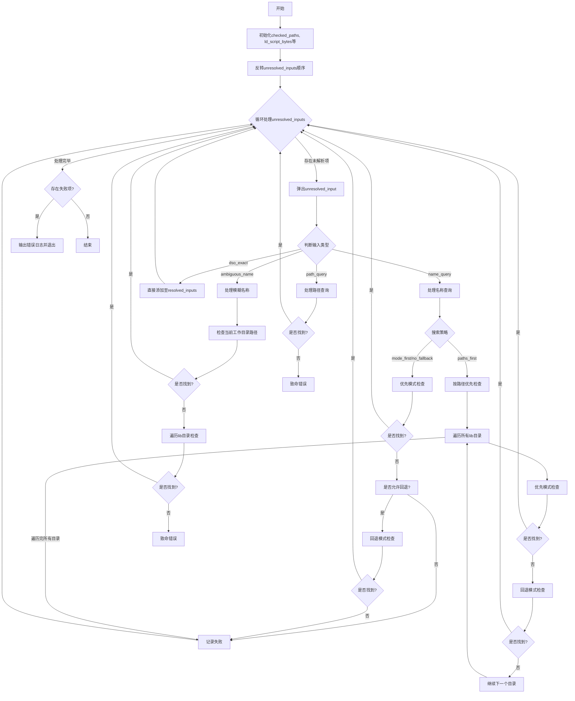

好的，我需要为提供的Zig函数`resolveInputs`绘制一个流程图。首先，我要理解这个函数的结构和逻辑。函数的主要目的是解析输入，处理不同的未解析输入类型，如名称查询、路径查询等，并将它们转换为已解析的输入。

首先，函数开始初始化一些临时变量，如`checked_paths`和`ld_script_bytes`，然后反转`unresolved_inputs`的顺序，以便按堆栈方式处理。接下来是一个循环，处理每个未解析的输入项。根据输入类型的不同，会有不同的处理分支，比如`.name_query`、`.ambiguous_name`、`.path_query`和`.dso_exact`。每个分支内部有不同的逻辑，例如在`.name_query`中，根据搜索策略（`mode_first`、`no_fallback`、`paths_first`）来尝试解析库路径，并处理失败的情况。如果所有尝试都失败，会将错误信息收集到`failed_libs`中。循环结束后，如果有失败的情况，会输出错误信息并退出程序。

在绘制流程图时，需要将主循环作为核心部分，分支处理不同的输入类型，每个类型下的逻辑流程需要细化，比如`.name_query`下的搜索策略判断和路径检查。同时，需要注意错误处理和资源释放的部分，如`defer`语句和最后的错误输出。

需要确保流程图的逻辑清晰，每个判断和循环都有正确的流向，特别是处理不同输入类型和搜索策略时的分支情况。此外，要注意函数中的异常处理和资源管理步骤，如`defer`的使用，这些也需要在流程图中体现出来，以确保完整性和准确性。
================================================
