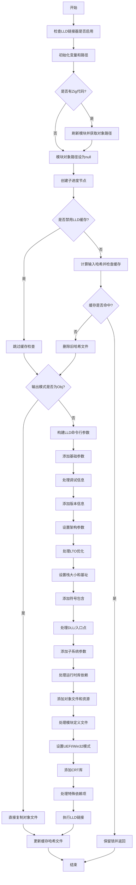

嗯，我现在需要根据用户提供的Zig代码中的函数`linkWithLLD`来画一个流程图。首先，我得仔细阅读这段代码，理解它的逻辑结构，然后逐步分解每个步骤，最后用Mermaid语法表示出来。

首先，函数`linkWithLLD`似乎是一个链接过程，使用了LLD链接器。代码中有很多条件判断和循环，需要理清各个分支。我需要先确定函数的主要流程，然后处理各个条件分支。

函数开始部分，检查是否启用了LLD链接器，然后初始化一些变量，比如`comp`、`gpa`、`directory`等。接着处理模块对象路径，如果有Zig代码需要编译，则刷新模块并获取路径，否则设为null。

然后，创建一个子进度节点，处理是否是库、动态库、可执行文件等条件。接下来处理缓存相关的逻辑，计算输入文件的哈希值，检查缓存是否存在，如果存在则跳过链接步骤，否则继续。

接下来，根据输出模式（Obj或其他）进行不同的处理。如果是Obj模式，直接复制对象文件；否则，构建LLD命令行参数并调用LLD进行链接。在构建命令行参数时，有很多条件分支，比如是否启用调试信息、链接选项、子系统设置等。

最后处理缓存更新，写入新的哈希值和清单文件，并保留锁文件。

在画流程图时，需要将这些步骤分解为不同的节点，并用条件判断来连接各个分支。可能的结构是：

1. 开始
2. 检查LLD链接器是否启用
3. 初始化变量和路径
4. 处理模块对象路径（如果有）
5. 创建子进度节点
6. 处理缓存哈希计算和检查
   a. 如果缓存命中，跳过链接
   b. 否则继续
7. 根据输出模式处理：
   a. Obj模式：复制对象文件
   b. 其他模式：构建LLD参数并调用链接
8. 更新缓存信息
9. 结束

每个主要步骤需要细化，特别是构建LLD参数的部分，有很多条件分支，比如是否链接libc、子系统设置、入口点名称等。这些需要在流程图中体现为不同的判断节点。

需要注意的是，代码中有很多错误处理和资源释放（如`defer`语句），但在流程图中可能不需要详细画出，除非对理解流程有重要影响。

现在需要将上述逻辑转化为Mermaid的流程图语法，确保每个步骤和条件判断正确连接，并保持流程的清晰。
================================================
