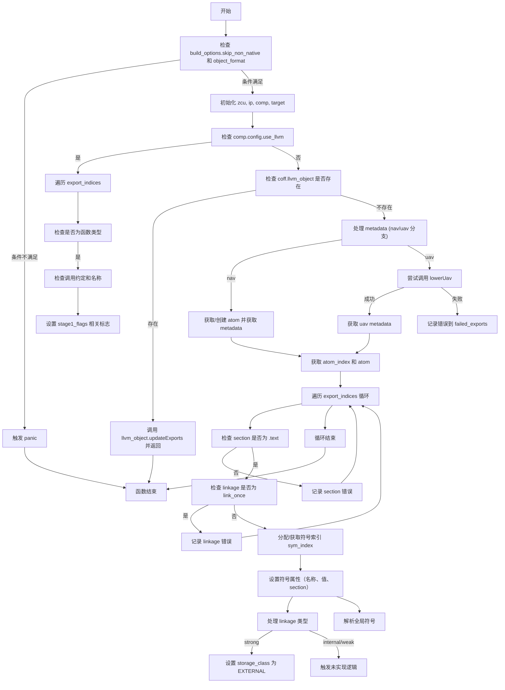

嗯，我需要为这个Zig函数`updateExports`画一个流程图。首先，我需要理解这个函数的结构和逻辑流程。让我先通读代码，看看它做了什么。

函数开始有一个检查，如果`build_options.skip_non_native`为真且`builtin.object_format`不是`.coff`，就会panic。然后获取一些上下文变量，比如`zcu`、`ip`、`comp`和`target`。接下来，如果使用LLVM，会遍历`export_indices`处理导出符号，特别是检测默认子系统。这部分有很多条件判断，比如检查函数类型、调用约定，以及不同名称的导出函数（如main、WinMain等），设置相应的标志。

然后，如果`coff.llvm_object`存在，就调用其`updateExports`方法并返回。否则，继续处理metadata，根据`exported`的类型（nav或uav）获取或创建metadata。对于uav的情况，可能需要调用`lowerUav`方法，处理失败情况。接着获取atom，遍历所有`export_indices`，处理每个导出符号。检查section名称是否为.text，处理linkage选项，分配符号索引，设置符号属性，最后解析全局符号。

在画流程图时，需要将这些步骤分解成不同的节点，包括条件判断、循环、函数调用等。可能的流程分支包括是否使用LLVM，处理nav或uav的不同路径，以及各种错误处理的情况。

需要注意的是，代码中有多个条件分支，比如`if (comp.config.use_llvm)`，`switch (exported)`，以及内部的循环和条件检查。每个分支需要明确表示出来。此外，错误处理部分，如`try zcu.failed_exports.putNoClobber`也需要在流程图中体现。

可能的结构如下：

1. 开始
2. 检查skip_non_native和object_format，若失败则panic
3. 获取zcu, ip, comp, target等变量
4. 检查是否使用LLVM：
   - 是：遍历export_indices，处理符号，设置标志
5. 检查llvm_object是否存在，若存在则调用其方法并返回
6. 处理metadata，分nav和uav两种情况：
   - nav：获取或创建atom，获取metadata
   - uav：尝试获取metadata，若不存在则调用lowerUav，处理失败情况
7. 获取atom_index和atom
8. 遍历每个export_idx：
   - 检查section名称是否为.text，否则记录错误
   - 检查linkage是否为link_once，否则记录错误
   - 处理符号名称，分配或获取sym_index
   - 设置符号属性，如名称、值、section等
   - 处理linkage类型，设置storage_class
   - 解析全局符号
9. 结束

需要注意循环结构，比如for循环处理export_indices，以及可能的错误路径。需要将这些步骤用流程图节点表示，并用箭头连接，条件判断使用菱形框，处理不同的分支。

可能遇到的困难是如何简洁地表示复杂的条件分支和循环，特别是内部的多个条件检查。需要确保每个判断点和处理步骤清晰，同时不过于冗长。可能需要将某些步骤合并或分组，保持流程图的可读性。
================================================

流程图说明：
1. **初始检查**：验证编译配置是否允许处理 COFF 格式；
2. **LLVM 路径**：若启用 LLVM，遍历导出符号并检测子系统相关标志；
3. **LLVM 对象处理**：若存在 LLVM 对象，直接委托其处理；
4. **元数据处理**：分 nav/uav 两种路径创建或获取原子数据；
5. **符号循环处理**：遍历所有导出符号，检查 section 和 linkage 约束，分配符号并设置属性；
6. **错误处理**：在不符合条件时记录错误信息；
7. **符号解析**：最终完成符号的全局解析。