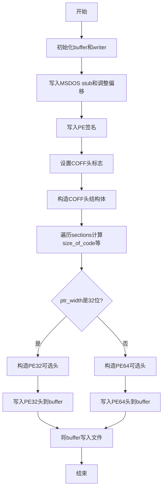
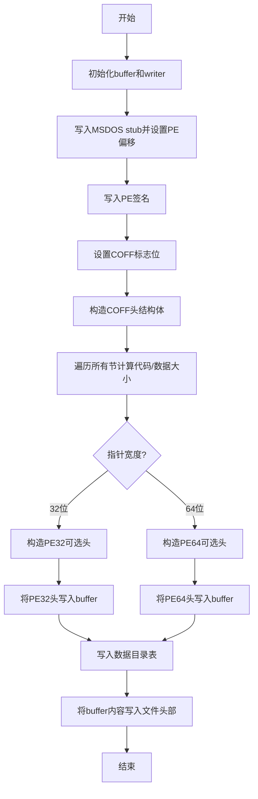

嗯，我现在需要帮用户用Mermaid画出这个Zig函数的流程图。首先，我得先理解这个函数是做什么的。看起来这个函数叫做writeHeader，属于Coff结构体的方法，用于生成COFF格式的文件头。COFF是Common Object File Format，通常用于可执行文件和目标文件的结构。

首先，我得通读代码，理清函数的主要步骤。函数开头获取了目标平台的信息和分配器（gpa），然后初始化了一个缓冲区来写入头数据。接着写入了MSDOS stub，然后调整了PE头的偏移位置。之后是写入PE签名，设置各种标志位，比如32位或64位的区分，动态库的标志等。

接下来是构造COFF头结构体，填充各个字段，比如机器类型、节的数量、时间戳、符号表位置等等。然后根据指针宽度（32位或64位）的不同，生成不同的可选头结构（OptionalHeaderPE32或PE64），并写入缓冲区。最后，将缓冲区的内容写入文件的起始位置。

我需要把这些步骤转化为流程图。流程图的开始应该是函数入口，然后按顺序处理各个步骤，包括条件判断（比如32位还是64位），循环（比如遍历各个节来计算代码、数据的大小），以及最终的写入操作。

需要注意的是，流程图中需要体现出条件分支，比如根据ptr_width选择不同的处理路径，还有循环处理每个节的部分。此外，错误处理部分（比如try语句）是否需要体现在流程图中？可能不需要，因为代码中用了try但可能没有多个错误处理分支，可能统一处理。

可能的结构：

1. 开始
2. 初始化buffer和writer
3. 写入MSDOS stub
4. 写入PE签名
5. 设置COFF头标志
6. 构造COFF头结构体
7. 计算各节的大小（循环处理每个节）
8. 根据ptr_width选择32或64位处理
9. 写入对应的可选头
10. 将buffer写入文件
11. 结束

其中步骤7是一个循环，遍历所有sections，累计size_of_code等变量。步骤8是一个条件分支，分为32位和64位两种情况，各自构造不同的头结构。

现在需要用Mermaid语法表示这个流程。Mermaid的流程图语法中，节点用矩形，条件判断用菱形，循环可能需要用子流程或注释表示。不过，Mermaid的流程图可能不太直接支持循环结构，可能需要用普通节点表示循环中的处理。

例如：

其中遍历sections可能需要展开，但为了简化，可能合并为一个节点。循环处理可以表示为“遍历所有sections，计算各size”。而条件判断ptr_width是32还是64位分支处理。

另外，在代码中，构造可选头之后，将头结构写入buffer，然后最后统一将buffer内容写入文件。所以流程中在构造不同的头之后，都汇聚到写入buffer，然后最终写入文件。

可能需要更详细的步骤，比如在构造COFF头结构体时，填充各个字段，但流程图可能不需要那么详细，除非用户有特别要求。

检查是否有遗漏的步骤，比如设置时间戳（根据repro标志），设置dll_flags，subsystem等，这些可能属于构造COFF头结构体或可选头的一部分，可能在流程图中不需要单独节点。

总结，流程图应涵盖主要步骤，分支和循环，确保逻辑正确。现在根据这个思路，编写Mermaid代码。
================================================

流程说明：
1. 初始化缓冲区并创建写入器
2. 写入MSDOS存根并设置PE头偏移量
3. 写入PE文件签名"PE\0\0"
4. 设置COFF标志（32位/64位/DLL等）
5. 填充COFF头基本信息（机器类型、节数量、时间戳等）
6. 遍历所有节计算代码段、初始化数据段的大小
7. 根据指针宽度分支处理：
   - 32位：构造PE32可选头（包含镜像基址、对齐信息等）
   - 64位：构造PE64可选头（调整基址字段为64位）
8. 写入对应的可选头结构
9. 添加数据目录表信息
10. 将所有头信息写入文件起始位置