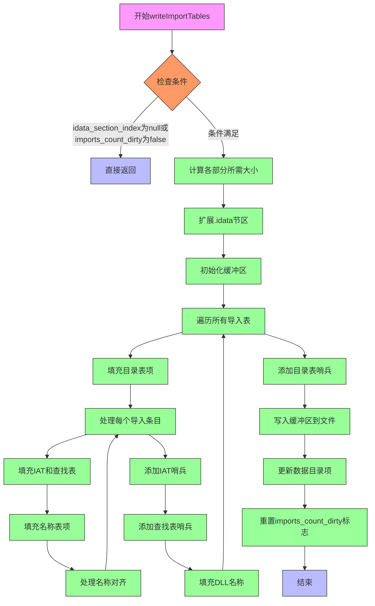

好的，我现在需要帮用户把给定的Zig函数`writeImportTables`转换成Mermaid流程图。首先，我需要理解这个函数的功能和结构。

这个函数似乎是处理COFF文件的导入表部分。它首先检查是否有需要处理的导入表，然后计算各部分所需的大小，扩展对应的节区，接着填充缓冲区，最后写入数据并更新目录项。

首先，我会通读代码，将主要步骤分解出来：

1. **条件检查**：检查`idata_section_index`是否存在，以及`imports_count_dirty`是否为真，否则直接返回。
2. **计算所需大小**：遍历所有导入表，计算IAT、目录表、查找表、名称表、DLL名称的总大小。
3. **扩展节区**：根据计算的总大小，扩展对应的节区。
4. **准备缓冲区**：初始化缓冲区，并分配足够的空间。
5. **填充各表数据**：
   - 导入目录表项（ImportDirectoryEntry）
   - IAT和查找表项
   - 名称表项（包括Hint和符号名）
   - DLL名称和扩展名
   - 添加哨兵（Sentinel）条目
6. **写入数据**：将缓冲区内容写入文件。
7. **更新数据目录**：设置导入目录和IAT的虚拟地址及大小。
8. **重置标志**：将`imports_count_dirty`设为false。

接下来，我需要将这些步骤转化为流程图的结构。流程图的开始是函数入口，然后根据条件判断是否继续执行。每个主要步骤对应一个流程节点，循环处理每个导入表的部分需要用循环结构表示。

需要注意的是，在计算大小和填充数据时，存在循环遍历`coff.import_tables`的部分，这部分可能需要用循环框来表示。此外，填充各表数据时涉及多个子步骤，可能需要分解成更细的节点。

可能会遇到的难点是如何正确表示循环和子步骤的结构，以及确保各个偏移量的更新顺序正确。另外，处理哨兵条目和各个表的结束条件也需要准确表达。

最后，按照Mermaid的语法，将各个步骤用合适的图形（如矩形、菱形判断框）连接起来，确保逻辑正确，流程清晰。
================================================
