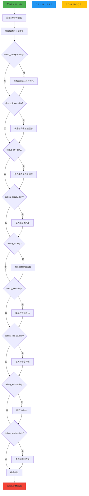

好，我需要帮用户用Mermaid画出这个Zig函数的流程图。首先，我得仔细阅读并理解这段代码的功能。这个函数名为`flushModule`，属于Dwarf模块，可能和生成调试信息有关。函数内部有很多代码块，处理不同的调试节（section），比如.debug_aranges、.debug_frame、.debug_info等。

首先，我需要确定函数的主要步骤。函数开始时处理`anyerror`类型，接着处理模块的根目录路径，然后逐个处理各个调试节，检查它们是否脏（dirty），如果是，则进行相应的写入或更新操作，最后断言所有节都不再脏。

接下来，我要将这些步骤转化为流程图。流程图的起始点是函数入口，然后按顺序处理各个部分。每个调试节的处理可能是一个判断框，检查是否脏，如果是，执行对应的操作，然后标记为不脏。最后是结束点。

需要注意代码中的循环结构，比如处理`dwarf.mods`的循环，以及每个节内部的循环处理单元（units）。这些循环在流程图中应该用循环节点表示，或者用子流程来简化，避免过于复杂。

另外，代码中有很多错误处理（try语句），但流程图可能不需要详细展示每个错误路径，除非用户特别要求。因此，可以假设正常流程，只展示主路径。

最后，确保流程图的逻辑清晰，步骤正确，没有遗漏关键部分。可能需要将代码块分解成更小的步骤，并合理组织判断和循环结构。
================================================
