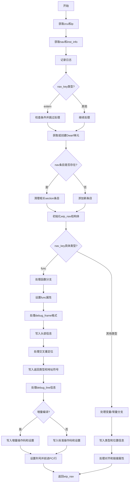

嗯，我需要为这个Zig函数`initWipNavInner`画一个流程图。首先，我得仔细读一遍代码，理解它的结构。看起来这个函数处理的是DWARF调试信息中的导航条目初始化。函数参数包括Dwarf结构体指针、PerThread实例、导航索引和符号索引。

首先，函数开始获取一些上下文信息，比如zcu和ip。然后通过`ip.getNav(nav_index)`获取导航条目。接下来处理日志记录，记录文件路径、行号、列号等信息。

然后检查`nav_key`，如果是`extern`的话，做一些条件判断，可能跳过某些处理。之后，获取或创建Dwarf单元，处理navs的条目，如果已存在则清理相关部分，否则添加新条目。

接着初始化`wip_nav`结构体，处理错误情况。根据`nav_key`的不同分支，处理函数（func）的情况，设置调试帧（debug_frame）、信息（debug_info）、行号（debug_line）等部分。对于函数类型，处理返回类型、地址符号、对齐等，并生成相应的调试信息。

对于非函数的情况，处理常量和变量的声明，写入类型信息、位置信息等。在函数分支中，如果是所有者导航，则设置函数相关属性，处理调试帧的格式（32位或64位），写入相应的头部信息，处理交叉条目重定位，设置地址符号等。

然后处理调试行信息，根据增量编译的情况，写入不同的操作码，设置文件、列号，并前进PC和行号。最后返回初始化的`wip_nav`结构体。

要画流程图的话，需要将主要步骤和条件分支转化为流程节点。比如开始、获取上下文、日志记录、处理extern情况、获取单元、处理nav条目、初始化wip_nav、根据nav_key分支处理函数和其他情况，处理调试信息，最后返回结果。

需要注意的是，代码中有多个条件分支，特别是`switch (nav_key)`的两个主要分支：处理函数和其他情况。在流程图中，这些分支需要用条件判断节点分开，然后分别处理各自的情况。此外，错误处理部分（errdefer）也需要适当表示，虽然流程图可能简化错误处理的路径。

可能的结构是：

1. 开始
2. 获取zcu和ip
3. 获取nav和inst_info
4. 记录日志
5. 处理nav_key为extern的情况
6. 获取或创建unit
7. 处理navs条目（存在则清理，否则添加）
8. 初始化wip_nav
9. 根据nav_key分支：
   a. 如果是函数：
      i. 处理函数相关设置（func_type, debug_frame, debug_info等）
      ii. 写入调试信息头
      iii. 处理不同debug_frame格式
      iv. 写入返回类型、地址符号等
      v. 处理debug_line信息（增量与非增量情况）
   b. 其他情况：
      i. 处理常量和变量的声明
      ii. 写入类型、位置、对齐等信息
10. 返回wip_nav

需要将每个主要步骤和条件分支用不同的节点表示，并用箭头连接流程。可能还需要处理错误路径，但可能简化为错误处理的节点。
================================================
