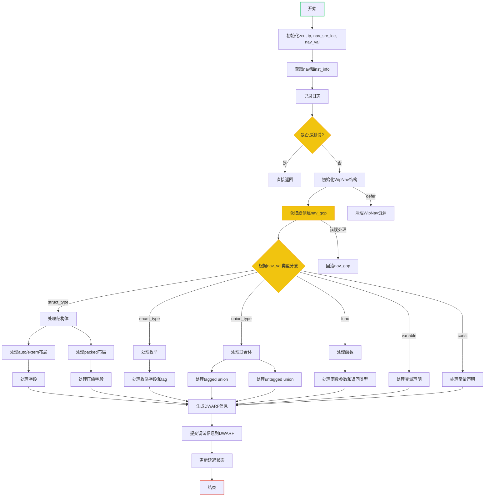

嗯，我需要帮用户把给出的Zig函数`updateComptimeNavInner`用Mermaid画出流程图。首先，我得理解这个函数的结构和逻辑流程。这个函数看起来是处理调试信息（DWARF）的生成或更新，特别是与编译时导航（comptime Nav）相关的部分。

首先，函数开始获取一些上下文信息，比如`zcu`、`ip`、`nav_src_loc`和`nav_val`。然后根据不同的类型（如结构体、枚举、联合体等）进行不同的处理。每个类型可能有不同的分支，比如处理结构体的布局（auto/extern、packed），处理枚举的字段，联合体的tagged或untagged情况，还有函数、变量等声明。

接下来，函数中有大量的条件判断和分支，比如根据`ip.indexToKey(nav_val.toIntern())`的结果进入不同的处理块。每个处理块内部可能还有更多的分支，比如结构体的不同布局方式，或者枚举是否有字段等。此外，还有一些错误处理和资源管理，比如`defer wip_nav.deinit()`和`errdefer`语句。

为了画流程图，我需要先确定主要的流程节点和分支点。主流程大致如下：
1. 初始化并获取必要的信息。
2. 判断是否是测试（test），如果是则返回。
3. 初始化`wip_nav`结构，并处理不同的类型分支。
4. 根据不同的类型（struct, enum, union, etc.）进入对应的处理逻辑。
5. 处理完成后，进行资源清理和结果提交。

每个类型分支内部又有不同的处理步骤，比如结构体需要处理字段、对齐、大小等；枚举处理字段名和值；联合体处理tag和字段布局等。此外，还有处理函数、变量、常量的不同情况。

需要注意错误处理和资源释放的部分，比如`errdefer`和`defer`语句的位置，这在流程图中可能需要表示异常流程或清理步骤。

可能遇到的困难是如何将复杂的条件分支和嵌套结构清晰地表达在流程图中，尤其是当有多个层级的分支时。需要合理使用子流程或者分组来保持图的可读性。

另外，函数最后调用了`dwarf.debug_info.section.replaceEntry`和`wip_nav.updateLazy`，这些也需要在流程图中体现，作为最终的提交步骤。

总结一下，流程图的大纲可能包括：
- 开始
- 初始化变量和获取上下文
- 检查是否是测试，如果是则结束
- 初始化WipNav结构
- 根据类型进入不同处理分支（struct, enum, union, func, var, const等）
- 每个分支内的具体处理步骤
- 处理完成后提交更改
- 结束

在绘制时，可能需要使用条件判断节点来分派不同的类型处理，每个类型分支下再展开详细步骤。同时，需要注意错误处理和资源管理的路径，可能用不同的箭头或节点表示。
================================================

流程说明：
1. 初始化阶段获取调试上下文信息
2. 通过`is_test`检查过滤测试用例
3. 对不同类型的调试符号（结构体/枚举/联合体/函数/变量/常量）采用不同处理路径
4. 每个分支最终汇聚到DWARF信息生成阶段
5. 包含错误处理路径（橙色节点）和资源清理机制（defer）
6. 使用不同颜色区分开始/结束节点和条件判断节点