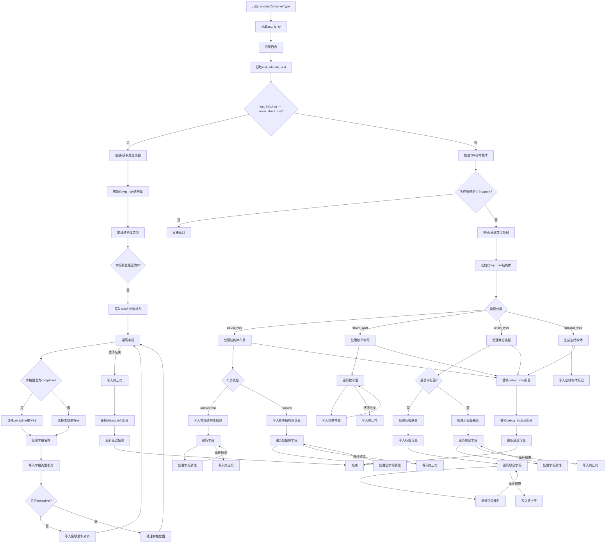

嗯，我现在需要画这个函数的流程图。首先，我得仔细看看这个函数的结构。函数名是updateContainerType，参数有dwarf、pt、type_index，返回错误类型。

首先，函数开始的时候获取了zcu和ip，然后根据type_index构造了ty。然后记录调试日志。接着，获取inst_info，这可能和类型声明有关。然后根据inst_info.file获取file和unit，再通过getModInfo获取file_gop。接下来，判断inst_info.inst是否是.main_struct_inst，如果是的话，处理结构体类型，否则处理其他类型。

在处理结构体类型的分支里，先通过types.getOrPut创建或获取类型条目，然后初始化wip_nav结构体。接着加载结构体信息，根据字段数量选择不同的缩写码。然后遍历每个字段，处理字段名称、类型、偏移量、对齐等，并根据是否comptime或其他条件选择不同的缩写码。最后替换debug_info中的条目，并更新延迟信息。

在else分支中，先检查ZIR指令的版本，然后根据不同的指令类型处理名称策略。如果名称策略是parent，就直接返回。否则，同样获取或创建类型条目，初始化wip_nav，然后根据不同的类型（struct、enum、union、opaque）分别处理。例如，对于struct类型，根据布局（auto/extern或packed）生成不同的调试信息；对于enum类型，处理枚举值和名称；对于union类型，处理带标签或不带标签的情况；对于opaque类型，生成空结构体信息。最后替换debug_info和debug_loclists的条目，并更新延迟信息。

需要注意的是，每个分支都需要处理字段的循环遍历，生成相应的调试信息条目，并根据不同条件使用不同的缩写码。此外，还要处理可能出现的错误，并正确释放资源（如wip_nav的deinit）。

现在，我需要把这些步骤转化为流程图。流程图的开始是函数入口，然后根据inst_info.inst是否为main_struct_inst分为两个主要分支。每个分支内部有各自的处理步骤，如获取或创建类型条目、初始化结构体、处理字段信息等。每个条件判断（如字段数量、布局类型、是否comptime等）都会影响流程的走向。最后，两个分支都会替换调试信息条目并更新延迟信息，然后结束。

需要确保所有可能的路径都被覆盖，并且条件判断正确反映在流程图中。可能还需要处理错误返回的情况，但函数定义中返回的是错误联合类型，所以每个可能出错的操作都需要检查错误，但流程图可能简化这些错误处理，除非特别重要。
================================================

流程说明：
1. 函数入口初始化关键参数后，根据`inst_info.inst`类型分为两条主路径：
   - **主结构体路径**：处理包含字段的普通结构体，通过嵌套循环处理每个字段的comptime/运行时属性
   - **其他类型路径**：通过ZIR指令分析处理结构体/枚举/联合/opaque类型的特殊逻辑
2. 所有路径最终会通过`replaceEntry`更新DWARF调试信息段
3. `wip_nav`结构体在两条路径中均被初始化并用于收集调试信息，通过`defer`确保资源释放
4. 字段遍历逻辑均采用循环结构，通过终止符标记结束
5. 联合类型处理进一步分为带标签和无标签两种子情况
6. 错误处理通过Zig的错误联合类型隐式覆盖，未在流程中显式标注