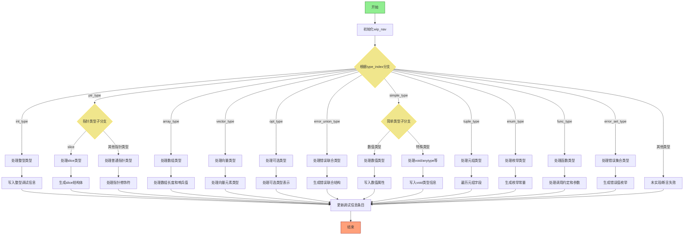

好的，我需要根据用户提供的Zig代码，画出这个函数的流程图。首先，我得理解这段代码的功能。函数名是updateLazyType，看起来是处理DWARF调试信息中的类型更新。代码中有很多条件分支，特别是switch语句，处理不同类型的type_index，比如int_type、ptr_type、array_type等等。每个类型有不同的处理逻辑，生成不同的调试信息。

首先，我应该理清函数的主干流程。函数开始时会初始化一些变量，比如wip_nav结构体，然后根据type_index的不同进入不同的处理分支。每个分支里可能有更多的条件判断和循环，比如处理结构体字段、枚举类型等。最后，函数会更新调试信息条目。

接下来，我需要将这些逻辑转换为流程图。可能需要分步骤：

1. 函数入口，初始化变量，如wip_nav。
2. 根据type_index选择不同的处理路径。
3. 每个type_index对应的处理逻辑，如int_type处理，ptr_type的不同情况（slice、其他指针类型）等。
4. 处理完类型后，更新调试信息条目。

需要注意的是，代码中有很多错误处理和内存管理（比如defer语句），但在流程图中可能不需要详细体现这些细节，主要关注主要逻辑分支。另外，像循环结构（如处理tuple_type的字段）需要用循环节点表示。

可能需要将每个大的switch case作为一个分支，再细化每个分支内的步骤。例如，ptr_type下分为.size的不同情况，slice需要处理ptr和len字段，array_type处理元素类型和长度等。

可能还需要注意递归或依赖其他函数的部分，比如wip_nav.refType可能会触发其他类型处理，但根据函数名，这可能属于延迟处理，可能在pending_lazy中处理，但流程图可能不需要深入这些细节。

总之，流程图需要覆盖所有主要的分支和关键步骤，结构清晰，层次分明。
================================================
