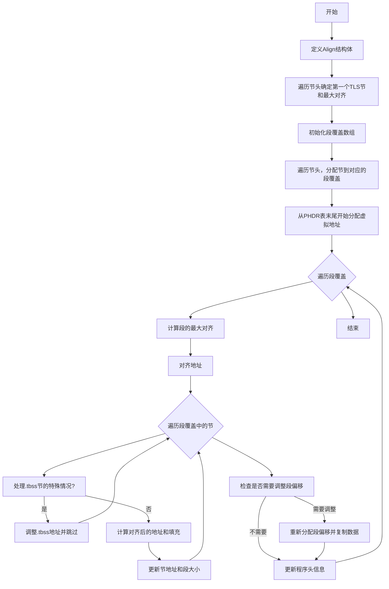

好的，我需要为给定的Zig函数`allocateAllocSections`绘制流程图。首先，我需要理解这个函数的功能和结构。

函数的主要目的是分配ELF文件中的可分配节（alloc sections），并处理相关的内存对齐和段（segment）的覆盖。让我逐步分析代码的结构和逻辑。

1. **Align结构体**：用于跟踪TLS（线程本地存储）节的最大对齐。包含`tls_start_align`和`first_tls_index`，以及判断是否是第一个TLS节的方法`isFirstTlsShdr`和对齐方法`align`。

2. **遍历节头（section headers）**：确定第一个TLS节并计算最大的对齐值`tls_start_align`。

3. **段覆盖（Cover）的初始化**：使用`Cover`数组来管理不同段的节索引。根据节的标志（flags）将节分配到对应的段覆盖中。

4. **分配虚拟内存地址**：从PHDR表的末尾开始，为每个段覆盖计算对齐后的起始地址，并逐个处理每个节，调整地址和大小。

5. **处理.tbss节**：这些节是特殊的，因为它们不需要实际的文件空间，但仍需调整地址。

6. **更新程序头（Program Headers）**：调整段的偏移量、虚拟地址、内存大小和文件大小，确保对齐和空间分配正确。

接下来，我需要将这些步骤转化为流程图。每个主要部分应该对应一个流程节点，包括条件判断和循环。需要注意的是处理.tbss的特殊情况，以及段的重新分配和文件空间的调整。

可能的分支和循环包括：

- 遍历所有节头以确定TLS对齐。
- 遍历段覆盖中的每个节进行地址分配。
- 处理.tbss节的循环。
- 检查文件大小是否需要重新分配段偏移。

最后，确保流程图的连贯性和逻辑正确性，使用Mermaid语法正确表示各个步骤、判断和循环。
================================================
