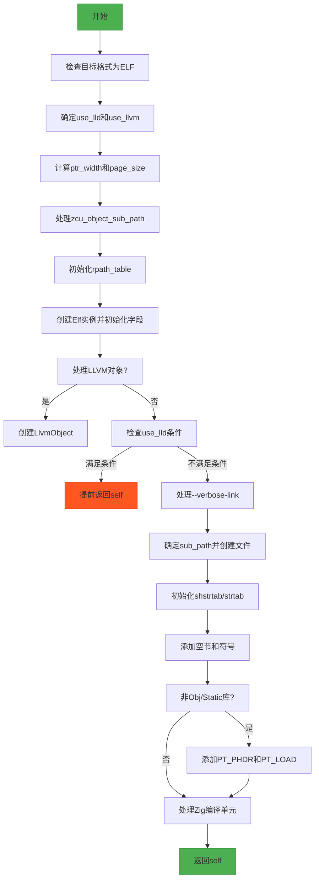

嗯，我现在需要帮用户把提供的Zig代码中的`createEmpty`函数用Mermaid流程图画出来。首先，我得仔细看一下这个函数的结构和逻辑。

首先，函数`createEmpty`接受几个参数，包括分配器、编译信息、输出路径和选项。然后它做一些初始化操作，比如检查目标格式是否为ELF，确定是否使用LLD或LLVM，处理页大小、符号版本等。接着，初始化一些数据结构，比如rpath_table，创建Elf结构体实例，设置各种属性，最后根据不同的条件（比如是否使用LLD或LLVM）进行不同的处理，比如创建文件、添加段和节等。

我需要把这些步骤分解成流程图的各个节点。可能需要注意条件判断，比如是否使用LLD或LLVM，不同的条件会导致不同的路径。比如，在函数中间有if (use_lld and ...) return self;，这意味着在某些情况下函数会提前返回。此外，还有错误处理的部分，比如errdefer，这可能需要在流程图中体现。

流程图的开始应该是函数入口，然后逐步执行各个步骤，包括参数检查、变量初始化、创建Elf实例、设置属性、处理不同的条件分支、文件操作、添加段和节等。最后返回创建的Elf实例。

需要注意的是，代码中有多个条件判断，比如关于use_lld、use_llvm、output_mode等，这些都需要在流程图中用菱形判断节点来表示不同的分支。例如，处理zcu_object_sub_path时根据use_lld和use_llvm是否为真来决定是否为null。还有在创建self.base.file时，根据use_lld来决定sub_path的值。

此外，初始化部分中的各种数据结构，如rpath_table、shstrtab、strtab等，都需要作为流程中的步骤。还要处理段和节的添加，比如addSection、addPhdr等函数调用。

可能还需要处理错误路径，但用户可能只需要主流程。不过根据代码中的errdefer，可能在流程图中需要体现错误处理，比如在创建文件失败时跳转到清理步骤。

总之，流程图的步骤大致如下：

1. 开始
2. 检查目标格式是否为ELF
3. 确定是否使用LLD或LLVM
4. 处理页大小和符号版本
5. 创建rpath_table
6. 创建Elf实例并初始化各字段
7. 处理LLVM对象（如果有）
8. 错误处理（errdefer）
9. 如果使用LLD且满足条件，提前返回
10. 处理详细链接输出（--verbose-link）
11. 确定输出路径并创建文件
12. 初始化各种表（如shstrtab, strtab）
13. 添加空的节和符号
14. 如果不是对象文件或静态库，初始化程序头（PT_PHDR和PT_LOAD）
15. 处理Zig编译单元（ZCU）相关的内容
16. 返回Elf实例

每个条件判断需要分支，例如是否使用LLD/LLVM，是否是动态库等。需要注意这些分支在流程图中如何连接。

现在需要将这些步骤转化为Mermaid的语法，正确使用节点和箭头，条件判断使用菱形，流程步骤使用矩形。
================================================

流程说明:
1. 从参数校验和基础配置开始
2. 通过条件判断确定是否使用LLD/LLVM工具链
3. 初始化ELF文件的核心参数(指针宽度/页大小等)
4. 根据编译模式生成中间对象文件路径
5. 初始化运行时路径表(rpath_table)
6. 创建ELF主结构并填充基础属性
7. 根据配置决定是否创建LLVM中间对象
8. 对使用LLD的特殊情况进行提前返回
9. 处理详细链接参数输出
10. 创建目标文件并初始化段表
11. 根据输出类型添加程序头(PT_PHDR/PT_LOAD)
12. 最终生成Zig编译单元相关数据
13. 返回完整的ELF链接器实例

菱形节点表示条件分支，绿色节点表示开始/结束，橙色节点表示提前返回路径。