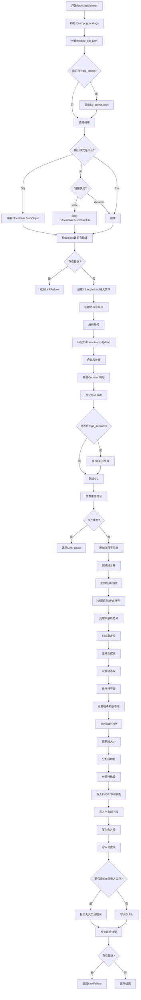

嗯，我需要帮用户把提供的Zig函数`flushModuleInner`用Mermaid画成流程图。首先，我得先仔细阅读代码，理解每个步骤的逻辑和流程。这个函数看起来是处理ELF文件链接过程中的各个阶段，比如符号解析、段合并、重定位处理等。

首先，函数开始处有一些初始化操作，比如获取comp、gpa、diags，处理module_obj_path。接着，根据输出模式（Obj、Lib、Exe）执行不同的操作。然后检查是否有错误，如果有的话直接返回错误。

接下来，创建linker_defined的文件，初始化符号，然后解析符号，处理common符号，标记导入导出，进行垃圾回收段处理，检查重复项，添加注释字符串，合并段，初始化输出段，处理启动停止符号，处理未解析的符号。

然后扫描重定位，生成合成段，设置动态段，排序段，处理哈希和版本符号表，初始化排序，更新段大小，分配段地址，处理特殊段，分配符号，写各个段的内容，最后处理ELF头部，处理入口点是否存在的情况，最后检查错误。

流程图的步骤应该覆盖这些主要步骤，每个条件判断（比如输出模式、是否有错误）需要分支。可能比较复杂的是条件判断和循环部分，比如遍历objects.items，处理每个索引对应的文件。

我需要将代码块分解成主要的流程节点，然后用箭头连接起来，注意条件分支和循环结构。比如，switch语句中的不同输出模式需要不同的分支。错误检查后的返回也需要作为分支处理。

需要注意的是，有些步骤可能包含子流程，比如resolveSymbols、markEhFrameAtomsDead等，可能需要简化为一个节点，除非用户希望更详细的子步骤。

另外，循环部分比如遍历objects.items，可以用循环节点表示，但Mermaid的流程图可能不支持显式的循环结构，所以可能需要用条件或子图来表示。

可能还需要处理错误处理路径，比如try语句中的错误捕获，导致流程跳转到错误返回。

总之，我需要将函数的主要步骤和关键条件判断提取出来，组织成一个结构清晰的流程图，用Mermaid语法表示出来。
================================================

该流程图关键特征说明：
1. 使用菱形节点表示条件判断（如输出模式选择、错误检查）
2. 包含主要逻辑分支（静态库/动态库处理、GC段处理）
3. 展示了错误处理路径（红色箭头表示错误返回）
4. 覆盖了ELF链接的核心步骤（符号解析、段合并、重定位扫描等）
5. 最后阶段区分可执行文件是否找到有效入口点
6. 最终统一错误检查确保所有路径的错误处理一致性

流程从初始化开始，经过多个处理阶段，最终根据是否存在错误决定返回状态。每个关键操作（如写入ELF头、处理符号表）都包含在流程中，同时保持了代码原有的执行顺序。