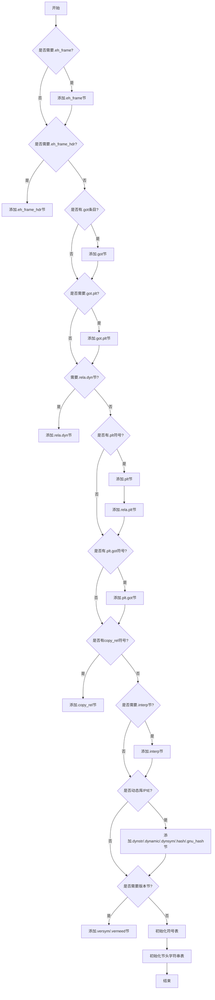

好的，我现在需要为这个名为initSyntheticSections的Zig函数绘制一个流程图。首先，我得仔细理解这个函数的功能和结构。

这个函数看起来是在初始化ELF文件中的合成节（synthetic sections）。ELF文件有很多标准节，比如.eh_frame、.got、.plt等，这些节在链接过程中动态生成。函数中的每个条件判断可能对应是否需要创建某个节。

首先，函数检查是否需要创建.eh_frame和.eh_frame_hdr节。通过检查是否有对应的索引，如果没有，则调用addSection来添加。这里需要注意的是，不同的架构可能有不同的类型，比如x86_64使用SHT_X86_64_UNWIND，其他架构用SHT_PROGBITS。

接下来是处理.got节，检查是否有条目存在，没有的话就创建。同样地，.got.plt节也是类似的处理方式。

然后是.rela_dyn节的创建，这里涉及到多个条件判断，包括got.flags中的某些标志，copy_rel中的符号数量，以及zig对象中的动态重定位数量。这些条件满足时才会创建该节。

接下来是.plt和.rela.plt节的处理，只要plt中有符号存在，就会创建这两个节。还有.plt.got和.copy_rel节的情况，处理方式类似。

之后是.interp节，用于指定动态链接器路径。这里需要考虑是否是静态链接以及是否启用了PIE（位置无关可执行文件）。如果目标平台有动态链接器，并且条件满足，就创建这个节。

接下来的部分处理动态链接相关的节，比如.dynstr、.dynamic、.dynsym、.hash、.gnu.hash等。这些节通常在动态库或PIE可执行文件中存在。同时，根据符号的版本信息，可能需要创建.gnu.version和.gnu.version_r节。

最后，函数调用initSymtab和initShStrtab来初始化符号表和节头字符串表。

在绘制流程图时，我需要将这些条件分支和节创建步骤组织成决策节点和操作节点。可能需要从函数入口开始，按代码顺序逐条件处理，每个条件对应一个判断框，根据条件是否满足进入不同的分支，添加相应的节。

需要注意的是，有些节的处理是独立的，而有些可能存在依赖关系。例如，.eh_frame_hdr的创建依赖于comp.link_eh_frame_hdr的设置，而.eh_frame本身是否创建则取决于是否有需要。

另外，流程图中需要体现出循环结构，例如在检查对象是否有动态重定位时使用了for循环，这在流程图中可能需要用循环节点表示，或者简化为条件判断后的分支。

可能还需要考虑错误处理，因为函数返回的是错误联合类型，但流程图中可能暂时忽略错误处理，专注于主要流程。

总结来说，流程图的结构大致如下：

1. 函数开始
2. 检查是否需要.eh_frame，如果需要则创建
3. 检查是否需要.eh_frame_hdr，并创建
4. 处理.got节
5. 处理.got.plt节
6. 检查是否需要.rela_dyn节，并创建
7. 处理.plt和.rela.plt节
8. 处理.plt.got节
9. 处理.copy_rel节
10. 检查是否需要.interp节，并创建
11. 处理动态链接相关的节（.dynstrtab, .dynamic等）
12. 检查是否需要版本相关的节（.versym, .verneed）
13. 初始化符号表和节头字符串表
14. 函数结束

每个步骤中的条件判断需要用菱形框表示，操作步骤用矩形框，箭头表示流程方向。需要确保所有分支都被正确连接，并且流程逻辑与代码一致。
================================================
