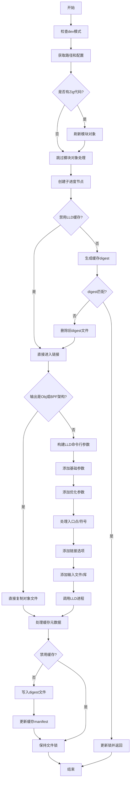

嗯，我需要用Mermaid来画出这个Zig函数的流程图。首先，这个函数的名字是linkWithLLD，属于Elf结构体的方法。看起来这个函数主要是用来链接ELF文件，使用LLD作为链接器。

首先，我应该先通读整个函数，理解它的主要步骤。函数开始的时候有一些初始化操作，比如检查开发模式，获取一些路径，处理模块对象路径。然后有一个条件判断，是否禁用LLD缓存，如果不禁用的话，会生成一个digest来检查是否需要重新链接。如果digest匹配，就直接返回，否则继续执行链接过程。

接下来，如果输出是对象文件或者目标架构是BPF，会直接复制文件，否则就构造LLD的命令行参数并调用LLD进行链接。最后处理缓存相关的操作，比如写入digest和manifest文件。

画流程图的时候，应该按照这些步骤分块。比如：

1. 初始化和检查dev模式。
2. 处理模块对象路径。
3. 创建子进度节点。
4. 检查是否需要缓存，计算digest，如果匹配则跳过链接。
5. 如果不需要链接，直接返回。
6. 否则，判断是否属于特殊处理的情况（如BPF），进行文件复制。
7. 否则，构建LLD命令行参数，调用LLD。
8. 处理缓存写入和锁的释放。

需要注意条件分支，比如是否有缓存，是否是obj模式，是否是BPF架构等。每个条件判断都需要在流程图中体现出来。

可能还需要注意错误处理，比如在文件操作失败时的处理，但流程图可能不需要包含所有错误分支，主要关注主流程。

现在，把这些步骤转化为Mermaid的流程图语法。使用不同的节点表示步骤，条件判断用菱形框，箭头表示流程方向。可能需要分多个部分，因为函数比较长。

例如：

开始 -> 初始化检查和路径处理 -> 检查是否有Zig代码 -> 是则flush模块对象 -> 处理模块对象路径 -> 创建子进度节点 -> 检查是否禁用LLD缓存 -> 是则跳过缓存处理 -> 否则生成digest并与之前的比较 -> 如果匹配，更新锁并返回 -> 否则继续链接过程 -> 判断是否是Obj模式或BPF -> 是则复制对象文件 -> 否则构造LLD参数 -> 调用LLD -> 处理后续缓存操作 -> 结束。

这可能需要更详细的分支和步骤。需要确保每个条件分支都有对应的路径，并且步骤之间的逻辑正确。

另外，注意函数中有多个可能的返回点，比如在缓存匹配时直接返回，或者在复制文件后返回，或者在调用LLD后继续后续操作。这些都需要在流程图中正确表示。

可能还需要考虑循环结构，比如处理多个输入文件，但在这个函数中，大部分是顺序处理，可能没有显式循环，而是通过遍历数组构造命令行参数。

总的来说，流程图需要覆盖主要的逻辑分支和步骤，确保每个条件判断和操作都被正确表示。
================================================

流程说明：
1. 初始化阶段处理开发模式检查和路径配置
2. 根据是否存在Zig代码决定是否处理模块对象
3. 缓存子系统通过digest比对决定是否跳过链接
4. 特殊输出模式（如BPF）直接使用文件拷贝优化
5. 正常链接路径构建完整的LLD参数链
6. 最终处理缓存元数据并保持文件锁状态
7. 所有路径最终汇聚到结束节点

菱形节点表示条件判断，矩形节点表示操作步骤，箭头方向表示流程走向。黄色节点为关键决策点，蓝色节点为重要操作步骤。