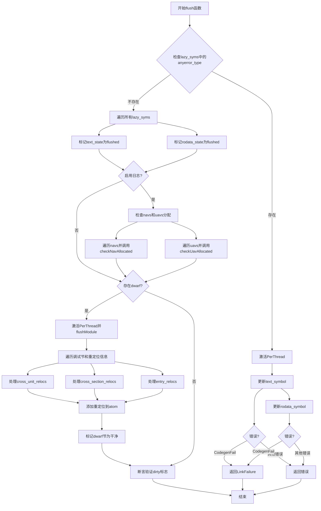

嗯，我需要为这个Zig的flush函数画一个流程图。首先，我应该仔细阅读代码，理解每个步骤的作用。函数名是flush，属于ZigObject结构体的方法，参数有elf_file和tid，返回类型是error union void。看起来这个函数负责处理惰性符号（lazy symbols），更新它们的状态，可能还涉及到调试信息（dwarf）的处理。

首先，函数开始检查是否有lazy_syms中的anyerror_type。如果有，就激活PerThread，处理text和rodata状态的符号，更新它们的符号索引。这里可能会遇到错误，比如CodegenFail，需要转换成LinkFailure。处理完anyerror_type后，遍历所有lazy_syms的值，将text_state和rodata_state标记为flushed。

接下来，如果启用了日志记录（build_options.enable_logging），会检查navs和uavs的分配情况。这部分可能需要调用checkNavAllocated和checkUavAllocated函数，但具体实现不在当前代码中，所以流程图里可能需要简化处理。

然后是处理dwarf部分。如果有dwarf存在，首先调用dwarf.flushModule，然后遍历各个调试节（如debug_info, debug_abbrev等），处理重定位信息。这里有很多循环和条件判断，针对不同的重定位类型（cross_unit, cross_section, external等），生成对应的重定位条目，并添加到atom_ptr的relocs中。处理完成后，标记一些dwarf节为干净（dirty标志设为false）。

最后，函数通过assert检查这些dirty标志是否确实被清除，确保没有遗漏。

流程图的大致结构应该是：

1. 处理lazy_syms中的anyerror_type。
2. 遍历所有lazy_syms，更新状态为flushed。
3. 如果启用日志，检查navs和uavs。
4. 处理dwarf部分，包括flushModule和处理各个调试节的重定位。
5. 断言确保dirty标志被清除。

需要注意循环和条件分支的处理，比如对于lazy_syms的遍历，dwarf中各个节的循环，以及不同的重定位类型处理。另外，错误处理部分（比如try和catch）也需要在流程图中体现。

可能需要用不同的形状表示开始/结束、条件判断、循环、处理步骤等。例如：

- 开始：椭圆
- 处理步骤：矩形
- 条件判断：菱形
- 循环：用矩形加循环标记

可能需要将大循环拆分为子流程，以保持流程图的可读性。例如，处理dwarf部分的重定位可以作为一个子流程。

另外，错误处理的部分（如catch error.CodegenFail）需要分支处理，可能转换为LinkFailure错误或其他错误返回。

现在需要把这些步骤转化为mermaid的流程图语法，注意正确的嵌套和箭头方向。
================================================

流程图说明：
1. 函数从检查`anyerror_type`的惰性符号开始
2. 存在则进行符号更新操作并处理可能的错误
3. 遍历所有惰性符号并标记为已刷新
4. 根据编译选项决定是否执行调试信息检查
5. 处理DWARF调试信息时：
   - 执行模块刷新
   - 遍历所有调试节（debug_info等）
   - 处理三种类型的重定位信息
   - 最终验证各节的dirty标志
6. 最终通过断言确保状态正确
7. 所有路径最终汇聚到结束节点

注意虚线框表示条件判断，直角矩形表示操作步骤，菱形表示错误处理分支，六边形表示循环遍历操作。