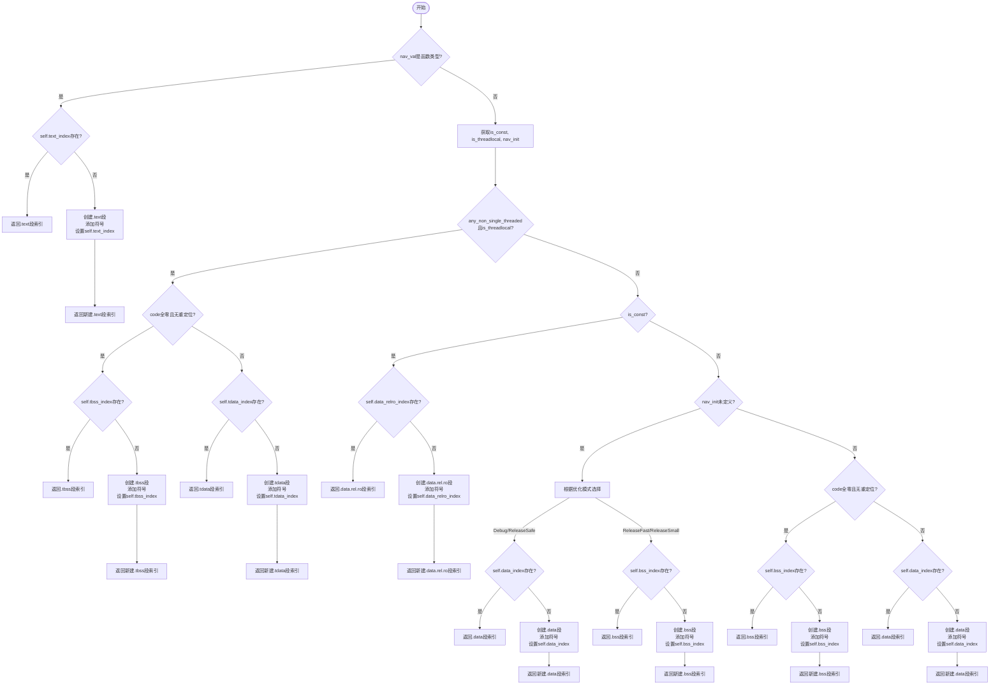

嗯，我需要画这个Zig函数的流程图。首先，我得仔细读一遍代码，理解它的逻辑。这个函数叫getNavShdrIndex，返回一个u32或者错误。看起来是处理ELF文件中的段（section）的。

函数开始部分，获取了一些变量，比如gpa、ptr_size、ip等等。然后检查nav_val的类型是否是函数类型。如果是的话，处理.text段，如果text_index存在就直接返回对应的section，否则创建新的.text段，并添加符号。

接下来，处理变量是否是const、线程本地存储（threadlocal）以及初始化情况。这里有个switch语句，根据不同的情况获取is_const、is_threadlocal和nav_init的值。

然后，如果有线程本地存储的情况，判断是否是.bss段（全零的数据），如果是的话，处理.tbss或.tdata段。如果不是线程本地存储，接着处理是否是const，如果是的话，处理.data.rel.ro段。

再往下，根据nav_init是否是未定义（undef）来决定是放在.data还是.bss段。根据优化模式的不同，选择不同的段。最后，如果都不是以上情况，判断是否是.bss，否则使用.data段。

流程图的开始应该是函数入口，然后根据不同的条件分支展开。每个条件判断对应一个菱形框，不同的分支指向不同的处理逻辑，比如创建不同的段，设置对应的符号索引，并返回对应的section。

需要注意各个条件之间的顺序，比如先检查函数类型，然后是线程本地存储，接着是const，再是初始化情况，最后处理普通的.data或.bss。每个分支处理完后都会返回相应的section index。

可能会有循环部分，比如检查code是否全零，这里用了一个for循环，但在流程图中可能需要用条件判断来表示。

另外，错误处理部分可能是在添加section时可能抛出OutOfMemory错误，但流程图里可能不需要特别标出，除非需要展示错误路径。

总结下来，流程图的结构大致是：

1. 开始
2. 检查nav_val是否是函数类型 → 是：处理.text段
3. → 否：获取is_const, is_threadlocal, nav_init
4. 检查any_non_single_threaded和is_threadlocal → 是：处理.tbss或.tdata
5. → 否：检查is_const → 是：处理.data.rel.ro
6. → 否：检查nav_init是否是undef，根据优化模式选择.data或.bss
7. → 否则检查是否是bss → 是：处理.bss
8. → 否：处理.data段
9. 返回对应的section index

每个处理步骤中，如果对应的section符号存在，直接返回，否则创建新section并设置符号，再返回。

需要将这些步骤用mermaid的流程图语法表示出来，注意条件分支和操作步骤的顺序。
================================================
