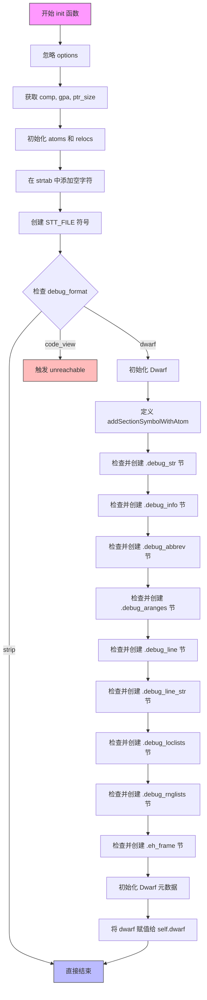

好的，我需要为提供的 Zig 代码中的 `init` 函数绘制一个流程图。首先，我需要仔细阅读代码，理解它的结构和工作流程。

首先，函数 `init` 接收三个参数：一个指向 `ZigObject` 的指针 `self`，一个指向 `Elf` 的指针 `elf_file`，以及 `options`。函数的返回类型是 `!void`，表示可能返回错误。

代码开始部分，忽略了 `options`，获取了 `comp`、`gpa` 和 `ptr_size`。接下来，初始化了 `atoms`、`relocs` 和 `strtab.buffer`。特别是添加了一个空的输入节和空的重定位节，并在字符串表中添加了一个零字节。

然后，创建了一个文件符号（STT_FILE），设置其名称偏移和符号索引，并更新了相关的 ELF 符号信息。

接下来是处理调试格式的部分，根据 `comp.config.debug_format` 的值，分为 `strip` 和 `dwarf` 两种情况。如果是 `dwarf`，则初始化 `Dwarf`，并定义了一个内部函数 `addSectionSymbolWithAtom` 来添加节符号和原子。

随后，检查并创建多个调试相关的节（如 `.debug_str`、`.debug_info` 等），如果它们不存在的话。每个节的创建包括定义节属性、添加节到 ELF 文件、更新符号和原子信息。

最后，如果是 `dwarf` 配置，初始化元数据，并将 `dwarf` 赋值给 `self.dwarf`。对于 `code_view` 的情况，则触发 `unreachable`。

在绘制流程图时，需要考虑各个步骤的顺序和条件分支，特别是 `switch` 语句中对 `debug_format` 的处理。需要将初始化步骤、符号创建、调试节的处理以及可能的错误处理都包含进去。

需要注意的是，每个调试节的创建逻辑类似，可以用循环或子流程表示，但代码中是逐个检查并创建的，因此在流程图中也需要逐一列出。另外，内部函数 `addSectionSymbolWithAtom` 需要作为子流程处理。

最后，确保流程图的逻辑清晰，步骤之间的转换正确，条件分支明确。
================================================
