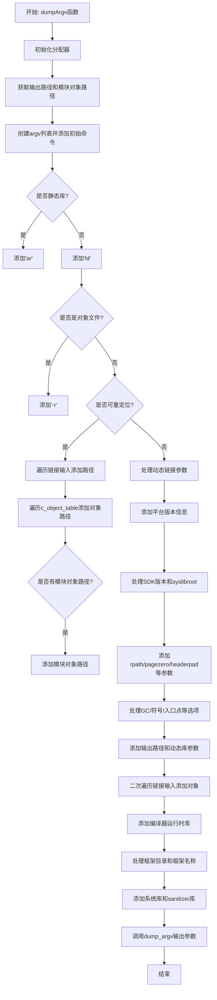

嗯，我需要为这个名为`dumpArgv`的Zig函数画一个流程图。首先，我得仔细阅读代码，理解它的结构和逻辑。这个函数看起来是用于构建一个命令行参数列表（argv），然后调用某个工具（比如ar或ld）来处理Mach-O文件。

首先，函数开始初始化一些分配器，比如arena_allocator，这可能用于临时内存分配。然后获取输出路径和模块对象路径。接着，创建一个argv的ArrayList，并添加初始的命令，比如"zig"，然后根据是否是静态库来决定使用"ar"还是"ld"。

接下来，根据不同的条件分支，比如是否是对象文件、是否可重定位等，添加不同的参数。比如，如果是可重定位的，会遍历链接输入并添加各种对象和库的路径。如果不是可重定位的，可能会有动态链接相关的参数，比如"-dynamic"、"-dylib"等。

中间有很多条件判断，比如处理SDK版本、系统根目录、rpath、页大小、头填充大小等等。然后处理各种链接输入，包括对象文件、归档文件、动态共享对象等。还有一些特定框架的处理，比如添加框架目录和框架名称。

最后，添加编译器运行时库、ubsan库等，并调用`Compilation.dump_argv`输出构建好的命令行参数。

现在，我需要将这些逻辑步骤转化为流程图。流程图的开始是函数入口，然后按照顺序处理各个步骤，包括条件判断和循环。每个条件分支（如if-else）需要分叉，循环处理（如for循环）需要循环结构。

需要注意的是一些重复的部分，比如多次遍历comp.link_inputs和comp.c_object_table.keys()，需要明确它们的执行顺序和条件。另外，有些参数只有在特定条件下才会被添加，比如当self.base.isDynLib()时才会处理install_name。

可能需要将整个流程分为几个主要部分：初始化、构建基本命令、处理可重定位的情况、处理非可重定位的情况、添加额外的参数和库、最终输出。每个部分内部有子条件和循环。

可能还需要注意错误处理，比如try语句，但在流程图中可能不需要特别表示，除非有显式的错误分支。

总的来说，流程图的结构应该是线性的，但包含多个条件分支和循环，每个分支处理不同的参数添加逻辑。需要确保所有可能的路径都被覆盖，并且步骤之间的顺序正确。
================================================
