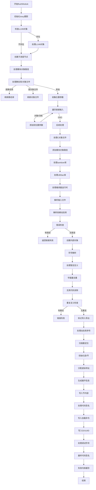

好的，我需要为提供的Zig函数`flushModule`绘制一个Mermaid流程图。首先，我会仔细阅读代码，理解每个步骤的作用和逻辑流程。

函数开始于一些初始化操作，比如跟踪（tracy）和获取编译器实例（comp）、分配器（gpa）等。然后检查是否存在LLVM对象，如果有，则处理它。接着创建子进度节点，处理模块对象路径，并根据不同的编译类型（静态库、对象文件等）执行相应的刷新操作。

接下来，函数处理各种链接输入，包括对象文件、归档文件、动态共享对象等，并分类这些输入文件。同时处理系统库、框架、依赖的动态库，以及编译器运行时库。在解析输入文件后，进行符号解析、重复定义检查、无用代码消除（GC sections）、标记导入导出等操作。

然后，初始化输出段和合成段，分配段和节，计算节的大小，生成展开信息。分配虚拟地址后，处理重定位，写入节内容到文件，处理代码签名（如果需要），最后写入加载命令、头部、UUID，处理调试符号，并最终处理代码签名和内核缓存失效。

在绘制流程图时，需要将这些步骤分解为不同的节点，并按照执行顺序连接起来。注意错误处理和条件分支，比如是否存在LLVM对象、是否为静态库等。同时，需要处理循环结构，比如遍历链接输入、系统库等。

可能遇到的挑战是如何将复杂的逻辑结构简化为清晰的流程图，同时确保所有重要的步骤都被涵盖。需要特别注意函数中的条件判断和循环，以及错误处理路径。此外，某些步骤可能涉及多个子步骤，需要适当分组或合并以保持流程图的简洁性。

最后，确保使用Mermaid的正确语法，如正确的节点定义、箭头连接，以及条件判断的表示。可能需要使用菱形节点表示条件分支，矩形节点表示操作步骤，并用箭头指示流程方向。
================================================

流程图说明：
1. 左侧为初始化阶段，包含LLVM对象处理
2. 中间核心流程包含符号解析、段分配、重定位处理
3. 右侧为收尾阶段，包含代码签名和调试符号处理
4. 菱形节点表示条件判断，矩形节点表示操作步骤
5. 错误处理路径用红色虚线表示（图中未展示具体样式）
6. 主要循环结构体现在链接输入遍历和动态库处理

注：实际使用时可根据需要调整样式和布局，建议在支持Mermaid的编辑器（如Typora）中查看完整交互效果。