嗯，我需要用Mermaid来画出这个Zig函数的流程图。首先，我得仔细阅读代码，理解每个步骤的逻辑。函数名为initMetadata，属于MachO结构体的方法，接收self指针和options参数，返回一个错误联合类型。

函数一开始检查self.base是否是可重定位的。如果不是，就进入主逻辑。首先计算base_vmaddr，这里有个blk块，使用pagezero_size和对齐函数得到。然后添加四个段：__TEXT_ZIG、__CONST_ZIG、__DATA_ZIG和__BSS_ZIG，每个段都有不同的vmaddr和权限。如果options中包含dwarf调试信息，会创建dSYM包并初始化元数据。

接下来定义了两个内部函数appendSect和allocSect，用于处理段的分配和附加。然后根据是否是可重定位的，分别调用allocSect或appendSect来处理各个段（__TEXT_ZIG、__CONST_ZIG、__DATA_ZIG、__BSS_ZIG）。如果是可重定位的，并且有dwarf选项，还会添加多个调试相关的段。

我需要把这些步骤分解成流程图中的各个节点。首先判断是否是relocatable，分支处理不同的逻辑。添加各个段的部分需要分步骤，每个段可能有不同的处理方式。调试信息部分也是一个条件分支。内部函数appendSect和allocSect可能作为子流程处理。

需要注意的是，流程图中要正确表示条件判断（如if语句）、循环（如果有的话，但这里似乎没有明显的循环）、函数调用（如addSegment、addSection等）以及错误处理（try语句）。由于是Mermaid，可能需要使用不同的形状来表示不同的节点类型，比如菱形表示条件判断，矩形表示操作步骤，子程序表示内部函数等。

可能的结构如下：

1. 开始
2. 判断是否是Relocatable？
   - 否：
     a. 计算base_vmaddr
     b. 添加四个段（__TEXT_ZIG等）
     c. 如果有dwarf，创建dSYM并初始化
   - 是：跳过上述步骤
3. 定义appendSect和allocSect内部函数
4. 处理各个段的section（__TEXT_ZIG、__CONST_ZIG等），根据是否是relocatable调用不同的函数
5. 如果是relocatable且有dwarf，添加调试段并初始化
6. 结束

需要确保每个条件分支都正确连接，步骤之间顺序正确。可能需要多个条件判断节点，尤其是在处理每个段的时候，需要判断是否是relocatable来决定调用allocSect还是appendSect。

另外，内部函数appendSect和allocSect的处理可能需要作为子流程或独立节点。但由于它们在代码中是作为结构体内部的函数定义的，可能在流程图中作为单独的处理步骤，或者直接作为操作步骤的一部分。

在绘制流程图时，还需要注意错误处理，例如try语句可能导致提前返回错误，但这里可能忽略错误处理路径，只关注主流程。
================================================

```mermaid
graph TD
    Start[开始] --> CheckRelocatable{self.base.isRelocatable?}
    CheckRelocatable --> |否| CalculateBaseVMAddr[计算base_vmaddr]
    CalculateBaseVMAddr --> AddTextSeg[添加__TEXT_ZIG段]
    AddTextSeg --> AddConstSeg[添加__CONST_ZIG段]
    AddConstSeg --> AddDataSeg[添加__DATA_ZIG段]
    AddDataSeg --> AddBssSeg[添加__BSS_ZIG段]
    AddBssSeg --> CheckDwarf{options.zo.dwarf存在?}
    CheckDwarf --> |是| CreateDSYM[创建dSYM并初始化]
    CreateDSYM --> DefineInternalFunc[定义appendSect和allocSect]
    CheckDwarf --> |否| DefineInternalFunc
    CheckRelocatable --> |是| DefineInternalFunc
    DefineInternalFunc --> ProcessTextSect[处理__TEXT_ZIG section]
    ProcessTextSect --> IsRelocatable1{是Relocatable?}
    IsRelocatable1 --> |是| AllocTextSect[调用allocSect]
    IsRelocatable1 --> |否| AppendTextSect[调用appendSect]
    AppendTextSect --> ProcessConstSect[处理__CONST_ZIG section]
    AllocTextSect --> ProcessConstSect
    ProcessConstSect --> IsRelocatable2{是Relocatable?}
    IsRelocatable2 --> |是| AllocConstSect[调用allocSect]
    IsRelocatable2 --> |否| AppendConstSect[调用appendSect]
    AppendConstSect --> ProcessDataSect[处理__DATA_ZIG section]
    AllocConstSect --> ProcessDataSect
    ProcessDataSect --> IsRelocatable3{是Relocatable?}
    IsRelocatable3 --> |是| AllocDataSect[调用allocSect]
    IsRelocatable3 --> |否| AppendDataSect[调用appendSect]
    AppendDataSect --> ProcessBssSect[处理__BSS_ZIG section]
    AllocDataSect --> ProcessBssSect
    ProcessBssSect --> IsRelocatable4{是Relocatable?}
    IsRelocatable4 --> |是| AllocBssSect[调用allocSect]
    IsRelocatable4 --> |否| AppendBssSect[调用appendSect]
    AppendBssSect --> CheckRelocDwarf{是Relocatable且存在dwarf?}
    AllocBssSect --> CheckRelocDwarf
    CheckRelocDwarf --> |是| AddDebugSects[添加调试段并初始化]
    AddDebugSects --> End[结束]
    CheckRelocDwarf --> |否| End
``` 

流程图说明：
1. 初始判断是否是可重定位文件，分支处理不同逻辑
2. 非可重定位时：
   - 计算基地址
   - 依次添加4个程序段
   - 处理调试信息(dSYM)
3. 定义两个内部函数appendSect/allocSect
4. 对每个段（text/const/data/bss）进行section处理：
   - 根据是否可重定位选择allocSect或appendSect
5. 最后处理可重定位文件的调试段
6. 所有路径最终汇聚到结束节点

注：流程图中省略了部分重复判断逻辑的细节，重点展示主流程和关键分支结构。实际代码中的错误处理（try语句）也未在流程图中显式体现，主要关注正常执行路径。