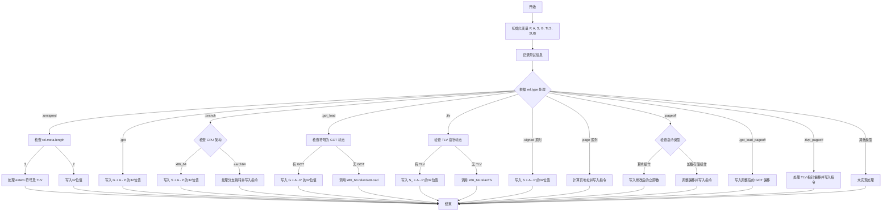

好的，我需要为给定的Zig函数`resolveRelocInner`绘制一个流程图。首先，我会仔细阅读代码，理解其结构和逻辑。

函数`resolveRelocInner`处理重定位，根据不同的重定位类型执行不同的操作。主要结构包括：

1. **变量定义和初始化**：如`P`, `A`, `S`, `G`, `TLS`, `SUB`，这些变量用于计算地址和偏移量。
2. **日志记录**：根据`rel.tag`的不同（`.local`或`.extern`），记录不同的调试信息。
3. **主switch语句**：根据`rel.type`的不同类型，执行不同的处理逻辑。例如`.unsigned`, `.got`, `.branch`等。

接下来，我需要将这一逻辑转换为流程图。每个`case`分支对应一个处理步骤，可能需要多个决策节点和操作节点。需要注意的是，某些分支内部还有条件判断，如`.unsigned`类型下根据`rel.meta.length`的不同处理方式。

此外，部分分支调用其他函数或方法，如`x86_64.relaxGotLoad`、`aarch64.writeBranchImm`等，这些在流程图中应表示为操作步骤。

需要确保流程图的每个条件分支都清晰，并正确表示代码中的逻辑流。例如，`.branch`类型下根据`cpu_arch`的不同处理，需要分支出不同的路径。

最后，检查是否有遗漏的分支或特殊情况，确保流程图全面反映代码逻辑。
================================================
