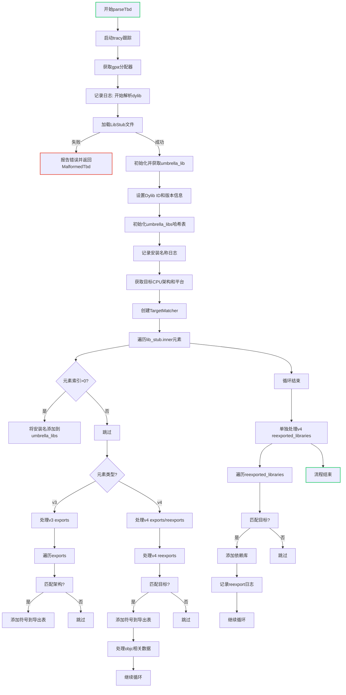

嗯，我需要为这个Zig函数画一个流程图。首先，我得仔细读一遍代码，理解它的结构和逻辑。函数是parseTbd，属于Dylib结构体的方法，接受一个MachO文件指针作为参数，返回一个错误联合类型。

首先，函数开始时会启动一个tracy跟踪，然后记录日志，获取gpa分配器。接着，它尝试加载LibStub，如果失败就报告错误。然后处理umbrella_lib，设置id的版本信息。接下来初始化umbrella_libs的哈希映射，记录安装名称，处理目标架构和平台。

然后创建TargetMatcher，遍历lib_stub.inner中的每个元素。对于每个元素，检查是否匹配目标，如果是第一个元素之后的，可能添加到umbrella_libs。然后根据元素是v3还是v4的不同结构，处理exports、weak_symbols、objc相关的内容，以及re-exports或reexported_libraries。对于v4的情况，还单独处理reexported_libraries。

最后，再次遍历lib_stub.inner，处理v4的reexported_libraries，添加依赖项。

流程图需要涵盖这些步骤，包括条件判断和循环结构。要注意不同版本的stub处理逻辑，以及错误处理和资源释放（如defer语句）。可能需要分块表示初始化、循环处理不同版本的stub、以及后续的依赖项处理。同时，要展示条件分支，比如检查是否匹配目标，是否已经存在umbrella_libs中等。
================================================
