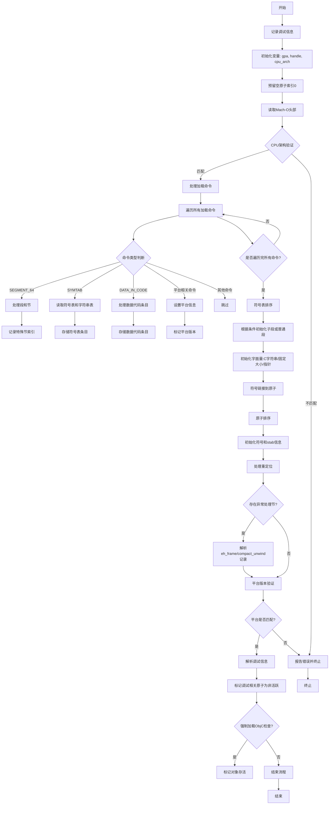

好的，我需要为给定的Zig函数绘制一个流程图。首先，我需要仔细阅读并理解这段代码的结构和逻辑。

函数名为`parse`，属于`Object`结构体的方法。它接受指向`Object`和`MachO`的指针，返回一个错误联合类型`!void`。函数的主要目的是解析Mach-O文件的内容。

首先，函数开始时会记录调试信息，然后初始化一些变量，如`gpa`（通用分配器）、`handle`（文件句柄）和`cpu_arch`（目标CPU架构）。接着，为原子（atom）预留索引0作为空原子。

接下来，函数读取Mach-O文件的头部信息，验证CPU架构是否匹配。如果不匹配，会报告错误并返回。

然后，处理加载命令（Load Commands），遍历每个命令。根据不同的命令类型（如SEGMENT_64、SYMTAB、DATA_IN_CODE等），执行相应的解析操作，如处理段、符号表、数据代码条目等。同时，处理平台相关的构建版本和最低版本信息。

之后，对符号表中的符号进行排序，根据不同的条件（如段、值、符号类型等）进行排序。根据是否有子段，初始化子段或普通段。

接下来，初始化各种字面量（如C字符串、固定大小字面量、指针字面量），并将符号链接到原子。然后，对原子进行排序，初始化符号和符号的stab信息，处理重定位信息。

如果存在异常处理框架（eh_frame）或紧凑解包（compact_unwind）段，进一步解析这些记录。之后，验证平台信息是否匹配，并处理可能的版本问题。

最后，解析调试信息，根据条件标记某些原子为非活动状态，检查是否需要强制加载ObjC代码，从而决定是否保持对象存活。

在绘制流程图时，需要按照上述步骤分块处理，每个主要操作作为一个节点，条件判断作为分支。例如，处理加载命令时，根据不同的命令类型分支到不同的处理流程；在验证CPU架构和平台时，根据检查结果决定是否报错。

需要注意错误处理路径，如读取文件内容时若字节数不符，返回错误。这些错误处理应在流程图中体现为终止流程或跳转到错误处理节点。

总结下来，流程图应包括以下主要步骤：
1. 初始化和头部解析
2. CPU架构验证
3. 加载命令处理（分多个子步骤）
4. 符号表处理和排序
5. 原子和段初始化
6. 字面量处理和符号链接
7. 异常和解包记录解析
8. 平台和版本验证
9. 调试信息处理
10. 原子状态设置和存活检查

每个步骤中的条件判断和循环结构需要用决策节点和循环节点表示，确保逻辑流程清晰。同时，错误处理路径需要用终止节点或合并节点处理。
================================================
