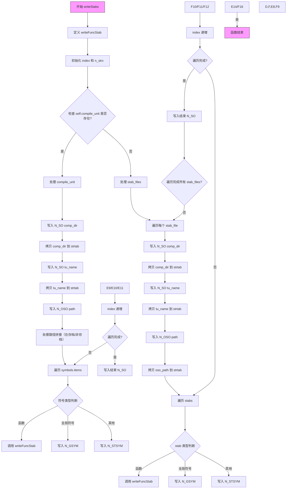

嗯，我需要为这个Zig函数`writeStabs`画一个流程图。首先，我得理解这个函数的功能。看起来这个函数是在处理Mach-O文件中的符号表（symtab）和字符串表（strtab），特别是生成stab（符号表条目）的信息。函数内部有多个条件分支，比如处理`compile_unit`是否存在，以及不同的符号类型。

首先，函数开始定义一个内部函数`writeFuncStab`，用来写入四个连续的符号表条目。然后初始化变量`index`和`n_strx`。接着检查`self.compile_unit`是否存在，如果存在，处理编译单元的目录、TU名称、路径等信息，并将这些信息写入symtab和strtab。这里涉及到多个字符串拷贝操作和符号表条目的设置。

如果`compile_unit`不存在，则处理`stab_files`中的每个文件，类似地打开作用域，写入N_SO、N_OSO等条目，然后遍历每个stab，根据符号类型调用`writeFuncStab`或写入其他类型的符号条目。

流程图中需要涵盖这些分支，包括循环遍历符号和文件，条件判断符号类型（如是否是函数、全局符号等），以及写入不同符号表条目的不同情况。同时，需要注意字符串处理部分，比如`@memcpy`和`n_strx`的更新。

可能的挑战是如何清晰地表达嵌套的条件和循环结构，尤其是`compile_unit`存在与否的两个主要分支，每个分支内部还有各自的循环和条件判断。另外，函数内部的闭包`writeFuncStab`也需要在流程图中体现出来，尽管它可能作为一个单独的步骤出现。

我需要确保流程图的步骤顺序正确，条件分支明确，循环结构清晰。可能使用不同的形状来表示开始/结束、处理步骤、条件判断、循环等。同时，需要标注每个步骤的关键操作，比如写入N_SO条目、拷贝字符串到strtab、处理符号类型等。
================================================
