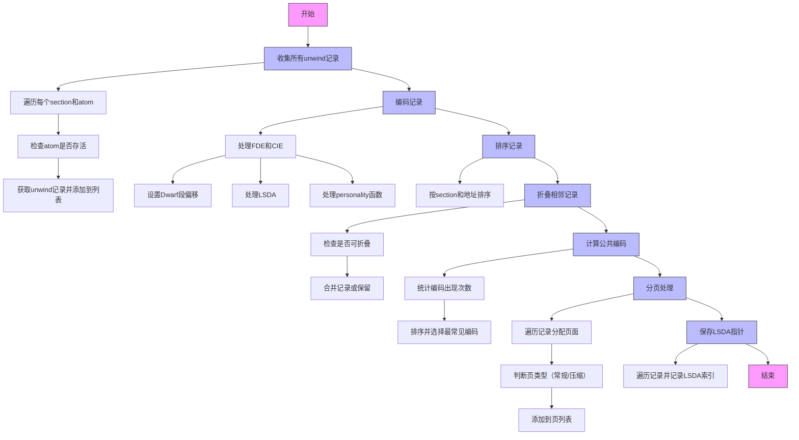

嗯，我现在需要为这个用Zig写的函数生成一个Mermaid流程图。首先，我需要理解这个函数的结构和各个部分的作用。让我先通读一下代码，看看它是如何组织的。

函数名是generate，参数是UnwindInfo的指针和MachO文件的指针。看起来这个函数的作用是生成unwind信息，可能用于异常处理或者调试。首先，函数开始用tracy进行跟踪，然后释放资源。接着，收集所有的unwind记录，遍历MachO文件的各个section和其中的atoms，获取每个atom的unwind记录，并将存活的记录添加到info.records中。

然后是编码这些记录。这里处理了FDE（Frame Description Entry）和CIE（Common Information Entry），设置Dwarf段的偏移，处理LSDA（Language Specific Data Area），以及处理personality函数。这部分可能涉及到如何将不同的调试信息编码到unwind记录中。

接下来是对记录进行排序，根据它们在输出段中的相对地址。使用了一个sortFn来比较两个记录的地址和section编号。排序之后是折叠记录，合并相邻的可以共享编码的记录，这样可以减少重复的数据。

然后计算常见的编码，这部分使用了一个哈希表来统计不同编码的出现次数，并按出现次数排序，选择最常见的作为公共编码，这样可以优化存储。

接着是计算页分配，根据记录的地址和编码类型，将记录分页，分为常规页和压缩页，确保每页的空间足够，并且处理不同的编码情况。

最后保存有LSDA指针的记录，记录它们的索引位置。

现在需要将这些步骤转化为流程图。流程图应该包括主要步骤，如收集记录、编码、排序、折叠、计算公共编码、分页、保存LSDA等。每个步骤之间的流程要清晰，分支和循环也需要表示出来。

需要注意的是，有些步骤内部有循环，比如遍历所有sections和atoms，或者遍历记录进行排序和折叠。此外，条件判断如是否可以折叠记录，是否达到页的最大条目等，也需要在流程图中体现。

可能的结构是：

开始 -> 收集所有unwind记录 -> 编码记录 -> 排序记录 -> 折叠记录 -> 计算公共编码 -> 分页处理 -> 保存LSDA指针 -> 结束

在每个步骤中，需要细化内部的循环和条件判断。例如，收集记录时，遍历每个section和atom，检查存活状态，添加记录。编码记录时，处理FDE和CIE，设置偏移和LSDA等。折叠记录时，遍历记录并合并相邻的可折叠项。

对于分页处理部分，可能需要一个循环处理每个记录，直到填满一页，然后决定页的类型（常规或压缩），并添加到页列表中。

最后，保存LSDA指针时，遍历所有记录，记录有LSDA的索引。

在画流程图时，可能需要使用子流程来表示循环和条件分支，或者用判断框和循环框来展示。

现在，我需要将这些步骤用Mermaid语法组织起来，确保逻辑正确，步骤清晰，循环和条件正确表达。可能每个主要步骤是一个节点，内部的处理用子节点或注释表示。不过由于Mermaid的流程图相对简单，可能需要简化一些细节，只展示主要流程。
================================================
