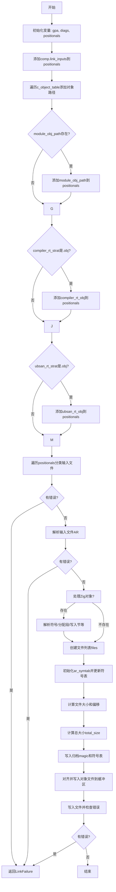

嗯，我需要帮用户把提供的Zig函数`flushStaticLib`用Mermaid画出流程图。首先，我得仔细阅读代码，理解每个步骤的作用，然后拆分成流程图的各个节点和判断条件。

首先，函数开始部分初始化了一些变量，比如`gpa`和`diags`，然后创建了一个`positionals`数组来存储链接输入。接着，它遍历`comp.c_object_table`的键，把每个成功的对象路径添加到`positionals`中。如果有`module_obj_path`，也会添加进去。然后检查`compiler_rt_strat`和`ubsan_rt_strat`是否为`.obj`，如果是，也添加对应的对象路径。

接下来，函数遍历`positionals`中的每个输入文件，调用`classifyInputFile`，如果有错误，会记录到`diags`。之后检查是否有错误，如果有就返回`LinkFailure`。

然后调用`parseInputFilesAr`，再次检查错误。之后处理Zig生成的可重定位目标文件，解析符号、分配段、计算大小、创建段、分配内存、写入段等操作。其中有一些日志记录和段名清理的步骤。

接下来，处理归档文件（ar），更新符号表，计算每个文件的偏移和总大小，最后将整个归档内容写入文件。过程中有很多错误检查和日志记录。

现在需要把这些步骤转化为流程图。需要注意条件判断（比如`if (module_obj_path)`，循环（比如遍历`positionals`），以及可能的错误处理分支。

可能的流程步骤：

1. 初始化变量（gpa, diags, positionals）
2. 添加comp.link_inputs到positionals
3. 遍历c_object_table添加路径
4. 添加module_obj_path（如果存在）
5. 添加compiler_rt_obj（如果策略是.obj）
6. 添加ubsan_rt_obj（同上）
7. 遍历positionals，调用classifyInputFile，处理错误
8. 检查diags是否有错误，有则返回
9. 调用parseInputFilesAr
10. 再次检查错误
11. 处理Zig对象（如果存在）：解析符号、标记导出、分配段等
12. 创建文件列表（包括Zig对象和其他对象）
13. 初始化ar_symtab，更新符号表
14. 计算每个文件的大小和偏移
15. 计算总大小
16. 写入归档的magic和符号表
17. 写入各个对象文件到缓冲区
18. 写入文件，设置结束位置，检查错误

需要将这些步骤用Mermaid的流程图语法表示，包括条件判断和循环结构。例如，对于每个条件判断，使用菱形节点，并根据结果分支。循环可能需要用子流程或注释表示。

可能的问题点：如何处理循环结构，比如遍历`positionals`或`files.items`。在流程图中，可能需要用循环的标记或者分解成多个步骤。

另外，错误处理部分，比如每次操作后检查`diags.hasErrors()`，需要作为条件分支。

现在尝试用Mermaid语法画出这个流程，确保步骤清晰，条件分支明确。
================================================

流程说明：
1. 初始化和收集所有输入文件路径
2. 逐步添加各类对象文件到positionals列表
3. 分类处理输入文件并检查错误
4. 解析AR格式输入文件
5. 处理Zig对象（若存在）的符号和段分配
6. 构建归档文件的符号表和文件布局
7. 计算对齐和总大小后写入最终归档文件
8. 全程伴随错误检查，任一环节出错立即终止