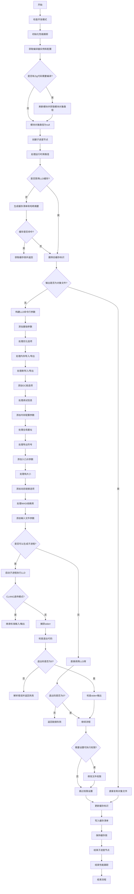

好的，我现在需要根据用户提供的Zig代码，用Mermaid画出对应的流程图。首先，我需要仔细阅读这段代码，理解它的逻辑结构和各个部分的功能。

首先，函数名是`linkWithLLD`，看起来是和链接WebAssembly模块相关，使用了LLD链接器。函数参数包括`wasm`结构体指针、内存分配器`arena`、线程ID`tid`和进度节点`prog_node`。函数返回一个错误联合类型。

接下来，代码一开始进行了一些初始化检查，比如`dev.check(.lld_linker);`，可能是在检查开发模式下的某些设置。然后使用`tracy`进行性能跟踪，结束时调用`defer tracy.end();`。

接着，从`wasm.base.comp`获取编译器实例`comp`，以及诊断信息`diags`、共享内存配置等。然后处理输出路径，检查是否有Zig代码需要编译，如果没有则跳过模块刷新。这里有一个条件判断，如果`comp.zcu`不为空，则调用`wasm.flushModule`，并处理模块对象路径。

之后创建子进度节点`sub_prog_node`，用于跟踪链接过程的进度。然后处理编译器和UBSan运行时库的路径，以及缓存相关的操作，比如创建`Cache.Manifest`，处理哈希摘要，检查缓存是否命中，如果命中则直接返回，否则继续执行链接步骤。

接下来，如果输出是对象文件（`is_obj`为真），则直接复制文件；否则，构造LLD的命令行参数，调用`wasm-ld`进行链接。这里有很多条件判断，比如是否启用LTO、内存导入导出、表导入导出、GC段、调试信息等，根据不同的配置添加不同的命令行参数。

然后处理位置参数，如对象文件、静态库等，并处理是否需要整个归档文件。接着调用子进程执行LLD命令，根据不同的情况处理子进程的输出和错误，如果链接失败则返回错误。

最后，处理缓存，写入哈希摘要和清单文件，保持锁以防止其他进程干扰输出文件。

现在，我需要将这些步骤转化为流程图。流程图应该包括主要的判断和分支，比如是否禁用LLD缓存、是否是对象文件、是否启用子进程等。同时，需要注意各个步骤的顺序和条件跳转。

可能的流程节点包括：

1. 开始
2. 检查开发模式
3. 初始化跟踪
4. 获取编译器实例和相关配置
5. 处理模块对象路径（是否需要刷新模块）
6. 创建子进度节点
7. 处理运行时库路径
8. 检查缓存是否禁用
9. 生成哈希摘要，检查缓存命中
10. 如果命中，直接返回
11. 否则，继续链接步骤
12. 判断是否是对象文件，执行文件复制或调用LLD
13. 构造LLD命令行参数
14. 执行LLD命令（子进程或直接调用）
15. 处理执行结果和错误
16. 设置文件权限（如果是可执行文件）
17. 更新缓存信息
18. 结束

需要处理的条件分支包括：

- `if (!wasm.base.disable_lld_caching)`: 是否启用缓存
- `if (is_obj)`: 是否是对象文件
- `if (std.process.can_spawn)`: 是否生成子进程
- 各种参数判断，如是否启用LTO、导入导出内存等

在流程图中，每个条件判断都会引出两个分支，需要正确连接各个节点。同时，注意异常处理和错误返回的路径，比如在调用子进程失败时的处理。

可能的结构：

开始 -> 检查缓存是否启用 -> 是 -> 生成哈希，检查命中 -> 命中 -> 返回
                                      -> 未命中 -> 继续链接
              -> 否 -> 直接链接

链接部分 -> 是否是对象文件 -> 是 -> 复制文件
                     -> 否 -> 构建命令行参数 -> 执行LLD -> 处理结果

执行LLD部分 -> 是否可以生成子进程 -> 是 -> 启动子进程，处理输出
                          -> 否 -> 直接调用LLD库

最后，处理文件权限和缓存更新，结束流程。

需要注意循环结构，例如处理多个链接输入和参数的部分，可能在流程图中用循环节点表示。

现在，根据这些分析，用Mermaid语法绘制流程图，使用合适的节点和箭头，标注条件判断和操作步骤。
================================================

该流程图展示了以下关键路径：
1. 初始化阶段包含环境检查和资源准备
2. 缓存处理逻辑包含哈希计算和缓存命中判断
3. 核心链接路径分为对象文件直接复制和完整LLD调用两种模式
4. LLD执行过程区分子进程调用和直接库调用两种方式
5. 后处理阶段包含权限设置和缓存更新
6. 错误处理路径贯穿整个流程，通过菱形判断节点进行分流

每个主要处理阶段都包含详细的参数配置步骤，特别是LLD命令行构建部分涵盖了内存管理、符号导出、优化选项等关键配置项。流程图中使用菱形节点表示条件判断，矩形节点表示操作步骤，箭头方向表示执行流向。