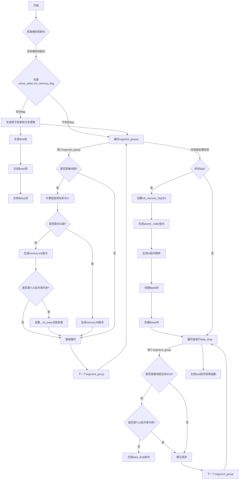

好的，我现在需要为这个用Zig编写的函数生成一个Mermaid流程图。首先，我得仔细阅读并理解这个函数的逻辑。这个函数名为emitInitMemoryFunction，看起来是用来生成WebAssembly的内存初始化函数的。函数内部处理了被动段、原子操作、内存填充、数据段初始化等。

首先，我需要理清函数的主要步骤。函数开始时检查是否有被动初始化，然后根据是否有共享内存配置，生成不同的指令。如果有虚拟地址中的init_memory_flag，会进行原子操作来检查标志，并根据结果跳转到不同的块（$init、$wait、$drop）。接着处理各个段组，分为BSS段和非BSS段，分别用memory.fill或memory.init来初始化内存。如果是共享内存且段是TLS，还需要设置__tls_base全局变量。之后，设置初始化标志，通知等待的线程，并可能进入等待或丢弃段的状态。最后，处理数据段的丢弃操作，并结束函数。

接下来，我需要将这些步骤转化为流程图的结构。可能的流程分支包括：

1. 是否存在virtual_addrs.init_memory_flag，这会导致不同的原子操作和分支逻辑。
2. 对于每个段组，判断是否是BSS段、是否是被动段、是否是TLS段，从而决定使用memory.fill、memory.init还是跳过。
3. 在共享内存的情况下，处理TLS段的特殊操作，比如设置全局变量。
4. 最后的段丢弃操作，根据条件决定是否丢弃。

需要注意的是，函数中有循环处理segment_groups，这在流程图中可能需要用循环结构表示。此外，条件判断较多，需要明确每个条件的分支路径。

在绘制流程图时，应该从函数入口开始，逐步分解每个主要步骤，用条件判断和循环结构连接起来。例如：

- 开始
- 检查是否有被动初始化（assert wasm.any_passive_inits）
- 如果有virtual_addrs.init_memory_flag，则生成原子检查和分支逻辑（br_table到$init、$wait、$drop）
- 遍历每个segment_group：
  - 如果是被动段：
    - 计算起始地址和大小
    - 如果是BSS段，使用memory.fill
    - 否则使用memory.init
    - 如果是TLS且共享内存，设置__tls_base
- 处理init_memory_flag的设置和通知
- 遍历segment_group进行数据段丢弃
- 结束

需要处理的条件分支包括：是否共享内存、是否是BSS段、是否是TLS段、是否需要丢弃数据段等。

可能遇到的难点是如何正确表示循环和嵌套的条件判断，特别是多个循环和条件交织的情况。需要确保每个分支都有明确的路径，并且在流程图中不会遗漏任何步骤。

另外，在代码中，有些部分是在特定条件下执行的，比如当virtual_addrs.init_memory_flag存在时才会生成某些指令，这些需要作为条件分支处理。例如，当存在flag时，生成原子操作和br_table，否则可能跳过这部分。

最后，确保流程图的结束点正确，即函数末尾的binary_bytes.appendAssumeCapacity(@intFromEnum(std.wasm.Opcode.end))，表示函数体的结束。

总结下来，流程图的大致结构应该是：

开始 → 检查被动初始化 → 处理init_flag条件 → 循环处理段组 → 处理段初始化 → 处理flag设置和通知 → 循环处理段丢弃 → 结束。

每个主要步骤内部可能会有多个条件分支，需要详细展开。
================================================
