好的，我现在要分析用户提供的Zig代码中的`finish`函数，并画出它的流程图。首先，我需要理解这个函数的功能和结构。

这个函数是处理WebAssembly（Wasm）模块的链接和最终生成步骤。它属于Flush结构体的方法，接收一个Flush指针和一个Wasm指针作为参数，返回一个可能的错误（`!void`）。函数的主要任务包括处理各种导入、导出、数据段、函数表、内存布局等，最终生成Wasm二进制文件。

接下来，我需要分步骤分析函数的主要流程：

1. **初始化变量和配置检查**：
   - 从`Wasm`结构中提取各种配置信息，如共享内存、目标架构（32位或64位）、输出模式（对象文件或可执行文件）等。
   - 处理入口点名称，并检查是否存在未解决的入口符号。

2. **处理编译单元（ZCU）**：
   - 检测内部函数调用，如编译器运行时内部函数和`@tagName`调用，处理符号依赖。
   - 处理函数导入和数据导入，标记已解决的导入并移除未使用的导入项。

3. **错误名称表处理**：
   - 填充错误名称的偏移和字节数据，确保错误名称结构已正确生成。

4. **处理导出项**：
   - 遍历导航导出项，根据类型（函数或数据）处理导出，处理隐藏导出和显式导出，并处理未定义的导出名称错误。

5. **处理未定义的符号**：
   - 检查函数、全局变量、表格和数据的导入是否未定义，根据配置允许未定义的情况，否则添加错误信息。

6. **合并间接函数表**：
   - 将不同来源的间接函数表项合并到一个表中，确保索引稳定。

7. **初始化函数处理**：
   - 如果有初始化函数（如构造函数），进行排序并添加到Wasm函数中。

8. **数据段合并和排序**：
   - 合并不同来源的数据段，并根据名称、对齐方式、引用计数等排序，以优化内存布局。

9. **内存布局计算**：
   - 计算栈、堆、TLS等的虚拟地址，确定内存的起始位置和大小，处理初始内存和最大内存的配置。

10. **处理线程局部存储（TLS）**：
    - 如果启用了共享内存且存在TLS段，生成相关的全局变量和初始化函数。

11. **生成二进制内容**：
    - 写入Wasm魔数和版本。
    - 按顺序生成各个段（类型、导入、函数、表格、内存、全局、导出、起始、元素、数据计数、代码、数据等）。
    - 处理重定位和应用调试信息（如名称段、生产者段、特性段等）。

12. **写入最终文件**：
    - 将生成的二进制内容写入文件，并设置文件结束位置。

在绘制流程图时，需要注意条件判断和循环结构，例如处理导入项时的循环、错误检查的条件分支、内存布局的不同情况（如是否放置栈在起始位置）等。同时，需要区分对象文件和可执行文件的不同处理路径，例如数据段的处理和重定位的应用。

可能的难点包括：
- 理解不同数据段和符号的处理逻辑，尤其是在合并和排序时的条件判断。
- 处理间接函数表和内存布局时的地址计算和对齐。
- 生成二进制段时的顺序和格式要求，如LEB128编码、段头的预留和替换。

需要确保流程图能清晰地展示各个步骤的顺序、条件分支和循环结构，以及关键的数据处理和错误检查点。使用Mermaid的流程图语法，用不同的节点表示函数的主要步骤，用条件判断节点（菱形）表示分支，用子流程表示复杂的处理逻辑。
================================================

```mermaid
flowchart TD
    A[开始] --> B[初始化变量和配置检查]
    B --> C{是否存在ZCU?}
    C -->|是| D[处理内部函数和标签调用]
    D --> E[处理函数导入]
    E --> F[处理数据导入]
    F --> G[填充错误名称表]
    G --> H[处理导航导出项]
    H --> I[检查未定义导出]
    C -->|否| I
    I --> J[处理入口点名称]
    J --> K{允许未定义符号?}
    K -->|否| L[检查未定义函数/全局/数据]
    K -->|是| M
    L --> M[合并间接函数表]
    M --> N[处理初始化函数]
    N --> O[合并和排序数据段]
    O --> P[计算内存布局]
    P --> Q{共享内存和TLS?}
    Q -->|是| R[生成TLS相关函数和全局变量]
    Q -->|否| S
    R --> S
    S --> T[生成二进制头部]
    T --> U[生成类型段]
    U --> V[生成导入段]
    V --> W[生成函数段]
    W --> X[生成表格段]
    X --> Y[生成内存段]
    Y --> Z[生成全局段]
    Z --> AA[生成导出段]
    AA --> AB[生成起始段]
    AB --> AC[生成元素段]
    AC --> AD[生成数据计数段]
    AD --> AE[生成代码段]
    AE --> AF[处理重定位]
    AF --> AG[生成数据段]
    AG --> AH{是对象文件?}
    AH -->|是| AI[生成链接段]
    AH -->|否| AJ
    AI --> AJ
    AJ --> AK[生成调试信息段]
    AK --> AL[写入文件]
    AL --> AM[结束]

    style A fill:#90EE90,stroke:#006400
    style AM fill:#FFB6C1,stroke:#8B0000
    style L fill:#FFA07A,stroke:#FF4500
    style K fill:#FFA07A,stroke:#FF4500
    style Q fill:#FFA07A,stroke:#FF4500
    style AH fill:#FFA07A,stroke:#FF4500
``` 

该流程图展示了以下关键路径：
1. 初始化配置后分ZCU存在与否两条路径
2. 多处理环节包含嵌套的条件判断（黄色菱形节点）
3. 核心代码生成阶段按Wasm规范顺序排列
4. 最后区分对象文件和可执行文件处理
5. 包含调试信息生成和最终文件写入环节

主要异常处理路径通过红色节点表示，绿色为开始/结束节点，橙色为重要条件判断节点。