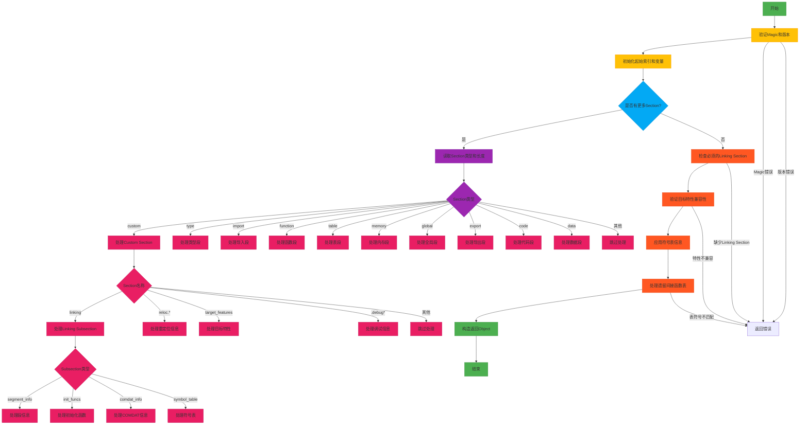

嗯，我现在需要帮用户用Mermaid画出一个Zig函数的流程图。这个函数是parse，看起来是处理WebAssembly（Wasm）对象的。首先，我需要理解这个函数的主要步骤，然后拆解成流程图的结构。

首先，函数开始部分检查了magic number和版本，这是常见的文件格式验证步骤。然后初始化各种起始索引，比如数据段、函数、表等。接下来进入一个循环，逐个处理每个section，比如custom、type、import等。每个section有不同的处理逻辑，比如处理linking section时有子类型处理，符号表、重定位信息等。处理完所有section后，进行一些后处理，比如应用符号表信息，检查特性兼容性等，最后返回构建好的Object结构。

我需要确定每个主要步骤和分支。例如，处理custom section时有多个子情况：linking、reloc、target_features、.debug等。每个子情况有不同的处理流程，比如处理linking时可能有segment_info、init_funcs、comdat_info、symbol_table等subsection。此外，错误处理部分也需要在流程图中体现，比如遇到不支持的特性或格式错误时返回错误。

可能的结构是：开始→验证magic和版本→初始化变量→循环处理各个section→每个section的分支处理→后处理→返回结果。每个分支需要详细展开，特别是custom section中的各种情况。

需要注意的是，流程图可能会非常复杂，因为有很多嵌套的条件和循环。需要合理分组，避免过于冗长。例如，可以将处理每个section的类型作为主分支，然后在每个类型下展开子步骤。错误处理的路径可以用菱形决策节点表示，并指向错误结束节点。

另外，函数中有很多错误检查，如!saw_linking_section时返回错误，这些都需要在流程图中体现。还有最后的特性检查和符号表应用部分，也是流程的一部分。

总结步骤：
1. 开始
2. 验证magic和版本
3. 初始化各个起始索引
4. 进入section处理循环
   a. 读取section类型和长度
   b. 根据类型处理不同section（custom、type、import等）
   c. 处理完每个section后检查是否到达末尾
5. 循环结束后检查必须的section是否存在（如linking）
6. 检查目标特性和兼容性
7. 应用符号表和段信息
8. 处理遗留的间接函数表情况
9. 返回构建的Object

每个主要步骤需要细化，尤其是处理不同section的部分，可能会有多个子流程。例如，custom section中的linking subsection处理多个子类型，而reloc处理重定位信息等。

现在需要将这些步骤转化为Mermaid的流程图语法，使用合适的节点和连接线，确保逻辑清晰，分支明确。
================================================

该流程图展示了：
1. 从文件头验证开始
2. 初始化索引后进入循环处理各个section
3. 对custom section的多个子类型进行详细分支
4. 处理完所有section后进行后验证
5. 最终构造返回对象
6. 用红色节点表示关键错误检查点
7. 使用不同颜色区分处理阶段（绿色-开始结束，黄色-初始化，蓝色-循环控制，紫色-段处理，橙色-后处理）