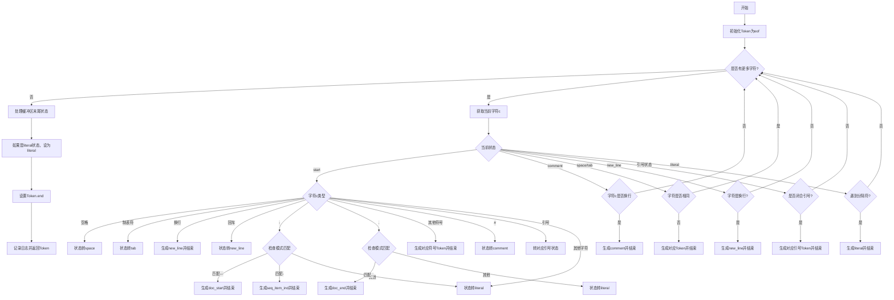

好的，我现在需要为这个用Zig编写的Tokenizer.next函数画一个流程图。首先，我需要仔细阅读代码，理解它的逻辑结构。函数的主要作用是从缓冲区中逐个读取字符，并根据不同的状态生成相应的Token。

首先，函数初始化一个Token结构体，默认的id是eof，然后进入一个循环，逐个字符处理。状态机有多个状态，比如start、new_line、space、tab等等。每个状态下根据当前字符的不同，可能会改变状态或者生成特定的Token。

我需要理清每个状态之间的转换条件。例如，初始状态是start，当遇到空格时转换到space状态，遇到制表符转换到tab状态，遇到换行符则直接生成new_line的Token并结束循环。对于更复杂的模式匹配，比如匹配"---"或"...", 需要检查后续字符是否符合条件，如果符合则生成对应的Token并跳过相应长度的字符。

接下来，处理注释状态时，遇到换行符或回车符则结束注释。在处理引号时，单引号和双引号有不同的处理逻辑，特别是双引号需要考虑转义字符的情况。字面量状态（literal）则在遇到某些特定字符时结束。

在循环结束后，如果已经到达缓冲区末尾，还需要根据当前状态决定最终的Token类型，比如如果是literal状态，则标记为字面量。

现在，我需要将这些逻辑步骤转化为流程图。流程图应该包括各个状态之间的转换，判断条件，以及生成Token的操作。可能需要使用不同的形状来表示开始、结束、判断和操作步骤。例如，用矩形表示操作，菱形表示判断条件，箭头表示流程方向。

需要注意的是，有些状态转换是直接的，比如遇到特定字符就改变状态，而有些则需要满足特定条件，比如matchesPattern函数的结果。此外，生成Token后需要跳出循环并返回结果。

在绘制过程中，可能需要将循环结构表示出来，特别是处理每个字符时的状态转换。同时，循环结束后的处理也需要单独表示，例如处理缓冲区末尾的情况。

最后，确保流程图的逻辑与代码完全一致，没有遗漏任何状态或转换条件。可能需要多次检查代码，确认每个分支都被正确覆盖，并且流程图的每个步骤都准确反映了代码的行为。
================================================

该流程图详细展示了以下逻辑：
1. 初始化Token后进入字符处理循环
2. 根据当前状态和字符进行多级条件判断：
   - start状态下处理所有特殊符号和状态转移
   - 处理注释、空格、制表符等简单状态
   - 处理引号闭合逻辑（包含转义字符判断）
   - 处理字面量结束条件
3. 循环结束后处理缓冲区末尾状态
4. 最终记录日志并返回生成的Token

每个菱形节点表示条件判断，矩形节点表示操作步骤，箭头上的文字表示触发条件，橙色路径表示可能提前结束循环返回Token的情况。