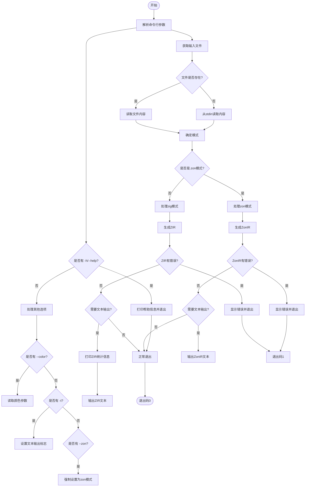

嗯，我需要为这个Zig函数`cmdAstCheck`画一个流程图。首先，我应该通读代码，理解它的主要步骤和逻辑分支。

函数`cmdAstCheck`的主要目的是进行AST检查。它处理命令行参数，读取输入文件或标准输入，解析文件生成AST和ZIR，然后根据不同的模式（zig或zon）进行处理，最后输出结果或错误信息。

首先，函数开始处检查开发模式，然后处理命令行参数。参数解析部分有一个循环，处理各种选项，比如帮助、输出文本、颜色设置等。如果遇到未识别的参数，会报错。接着确定输入文件是来自命令行参数还是标准输入。

然后，根据文件扩展名决定是使用.zon模式还是.zig模式。读取文件内容，构建文件结构。如果是标准输入，则从stdin读取内容。

接下来，根据模式进行不同的处理。对于.zig模式，生成ZIR，检查错误，如果有错误则输出并退出。如果用户要求输出文本（-t选项），则打印相关信息。对于.zon模式，生成ZonIR，同样处理错误，并输出结果。

在输出信息时，会统计各种字节大小和数量，然后调用不同的打印函数输出结果。如果有错误，进程会以非零状态退出。

流程图中需要涵盖这些主要步骤：参数解析、文件读取、模式判断、语法树生成、错误处理、结果输出。每个条件分支（如参数选项、模式选择、错误是否存在）都需要在流程图中体现。

需要注意处理参数时的条件判断，比如`-h`、`-t`、`--color`等，以及文件来源（命令行文件或stdin）。还有模式选择的逻辑，根据文件扩展名或强制参数决定。

在错误处理部分，无论是ZIR生成错误还是ZonIR错误，都会收集错误信息并输出到stderr，然后退出。输出统计信息时，需要判断是否启用了调试扩展。

可能的分支包括：是否请求帮助，是否指定了颜色选项，是否强制zon模式，输入文件是否存在，是否生成错误，是否请求文本输出等。

最后，根据不同的路径，流程会以成功或失败退出。
================================================
