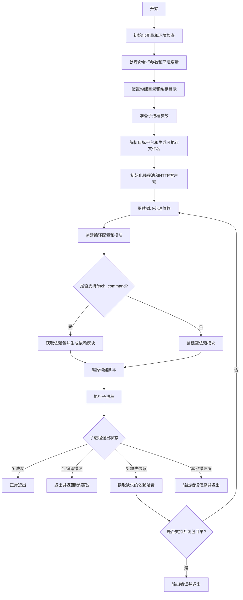

嗯，我需要为这个Zig函数`cmdBuild`画一个流程图。首先，我得仔细看看这个函数是做什么的。看起来这是一个处理构建命令的函数，负责配置和运行构建过程。函数内部有很多变量声明和处理命令行参数的逻辑，然后设置构建环境，处理依赖，编译构建脚本，最后执行子进程来运行构建。

首先，我应该理清楚函数的主要步骤。函数开始于检查开发命令，然后处理各种环境变量和命令行参数。接着，它会设置构建文件、缓存目录、库目录等。然后准备子进程的参数，包括Zig可执行路径、各种目录参数和种子值。之后，处理颜色输出、并行作业数等选项。

接下来，函数会解析目标平台，生成构建脚本的可执行文件名，并处理全局和本地缓存目录。然后初始化线程池和HTTP客户端（如果需要获取依赖）。之后，进入一个循环，处理可能的依赖缺失情况，创建编译配置，构建模块，处理依赖关系，最后编译构建脚本。

如果子进程可以生成，函数会执行它，并根据退出代码处理结果。如果子进程返回特定代码（如3），则表示需要处理缺失的依赖，函数会重新进入循环。

现在，我需要将这些步骤转化为流程图。流程图应该包括开始、处理参数、配置环境、准备子进程、处理依赖、编译构建脚本、执行子进程、处理结果，以及可能的循环回到依赖处理。

需要注意的是，函数中有条件判断，比如是否支持获取命令、是否处于特定操作系统等，这些在流程图中需要用判断节点表示。此外，循环处理依赖的部分也需要正确表示。

可能的结构如下：
1. 开始
2. 初始化变量和环境检查
3. 处理命令行参数和环境变量
4. 配置构建目录和缓存目录
5. 准备子进程参数
6. 解析目标平台和生成可执行文件名
7. 初始化线程池和HTTP客户端
8. 进入循环：
   a. 创建编译配置和模块
   b. 处理依赖（获取包、创建依赖模块）
   c. 编译构建脚本
   d. 执行子进程
   e. 根据子进程退出代码处理结果（成功、错误、重新处理依赖）
9. 结束或循环

在绘制流程图时，需要明确每个步骤之间的顺序和条件分支，尤其是循环部分和处理子进程退出代码的部分。可能还需要处理错误情况，如致命错误导致进程退出。

最后，确保流程图的节点和箭头清晰，能够反映函数的逻辑流程，包括主要步骤和关键判断点。
================================================
