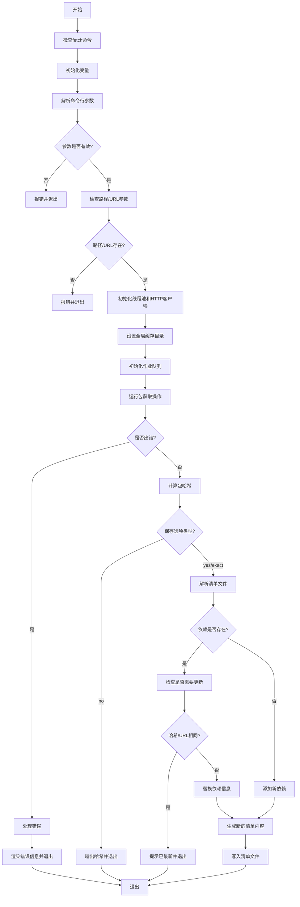

好的，我现在需要为给定的Zig函数`cmdFetch`绘制一个流程图。首先，我需要理解这个函数的功能和结构。让我先通读一遍代码，了解它的主要步骤和逻辑。

函数`cmdFetch`似乎是一个处理获取包依赖的命令行工具。它接受分配器、参数等，并执行获取操作，可能涉及到网络请求、缓存管理、依赖解析等。

首先，函数开始进行一些初始化检查，比如调用`dev.check(.fetch_command);`，这可能是在检查命令是否有效。然后定义了一些变量，比如颜色设置、Btrfs工作区标志、路径或URL选项、全局缓存目录覆盖等。

接下来，解析命令行参数。这里有一个循环遍历`args`数组，处理各种选项，比如帮助、全局缓存目录、调试哈希、保存选项等。如果遇到未识别的参数，会报错退出。

然后，检查是否提供了路径或URL参数，如果没有，则报错。之后初始化线程池和HTTP客户端，用于并发处理和网络请求。接着设置进度条，开始获取操作。

之后，处理全局缓存目录，打开或创建目录。初始化作业队列，用于管理获取任务。然后创建`Package.Fetch`结构体，运行获取操作，捕获可能的错误，比如内存不足或获取失败。

如果存在错误，会渲染错误信息并退出。否则，计算包的哈希值，并根据保存选项决定是直接输出哈希值，还是将依赖信息保存到`build.zig.zon`文件中。

在保存依赖的情况下，会处理URL的解析，可能替换提交哈希，然后更新或创建依赖项。这里涉及到解析现有的清单文件（manifest），进行修改，然后写入新的内容。

整个流程涉及到多个可能的路径，比如参数解析错误、网络请求失败、文件写入问题等。需要将这些分支和步骤清晰地展现在流程图中。

现在，我需要将这些步骤分解成流程图中的各个节点，并用条件判断连接起来。可能的节点包括：初始化、参数解析、路径/URL检查、线程池和HTTP客户端初始化、全局缓存处理、获取包信息、处理错误、计算哈希、保存依赖、更新清单文件等。

每个判断点，比如参数是否有效、是否提供了必要参数、保存选项的类型等，都需要对应的条件分支。此外，错误处理路径也需要明确标出。

最后，将所有步骤按照执行顺序和逻辑关系连接起来，形成完整的流程图。
================================================
