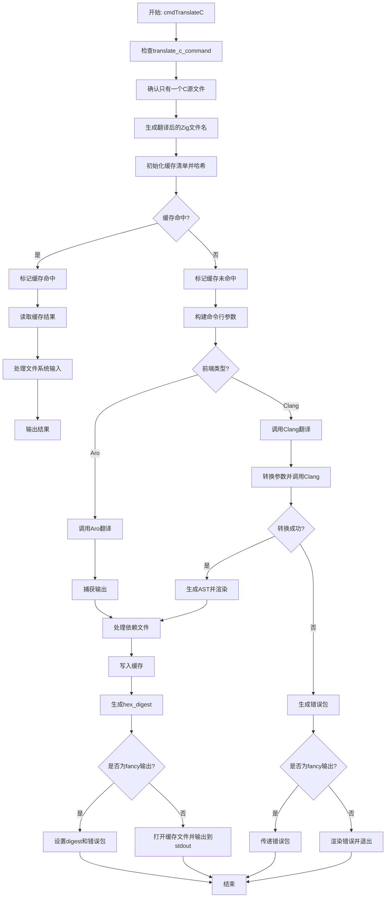

好的，我需要为提供的Zig函数`cmdTranslateC`画一个流程图。首先，我需要理解这个函数的功能和结构。

函数`cmdTranslateC`似乎是处理将C代码转换为Zig代码的命令。它涉及编译管理、缓存处理、调用不同的C前端（如Clang或Aro），处理错误，以及输出结果。

首先，我会通读整个函数，识别主要的步骤和条件分支。例如：

1. 检查是否为`translate_c_command`。
2. 确保只有一个C源文件。
3. 生成翻译后的Zig文件名。
4. 初始化缓存清单（Cache.Manifest）并进行哈希处理。
5. 检查缓存是否命中。如果命中，直接使用缓存结果；否则，执行转换过程。
6. 根据使用的C前端（Clang或Aro）构建命令行参数。
7. 执行相应的翻译命令（Aro或Clang处理）。
8. 处理依赖文件（如果有的话）。
9. 处理转换结果：成功则写入缓存，失败则处理错误。
10. 根据输出模式（fancy或普通）输出结果或错误信息。

接下来，我需要将这些步骤转化为流程图中的节点，并确定它们之间的流程和条件分支。例如，缓存命中与否是两个不同的路径。使用不同的C前端也会导致不同的处理流程。

需要注意错误处理部分，例如在`man.hit()`失败时如何处理，以及当转换过程中出现错误时如何生成错误包并退出。

可能遇到的挑战包括正确表示条件分支（如`if (fancy_output)`，`switch (comp.config.c_frontend)`等），以及确保所有可能的执行路径都被覆盖。此外，需要处理循环和异常流程，例如`defer`语句中的资源释放。

在绘制流程图时，应使用矩形表示操作步骤，菱形表示条件判断，箭头表示流程方向。可能需要将复杂的步骤分解为子流程，例如“调用Clang翻译”或“处理依赖文件”。

最后，验证流程图是否准确反映了函数的逻辑，确保没有遗漏重要的步骤或条件。
================================================
