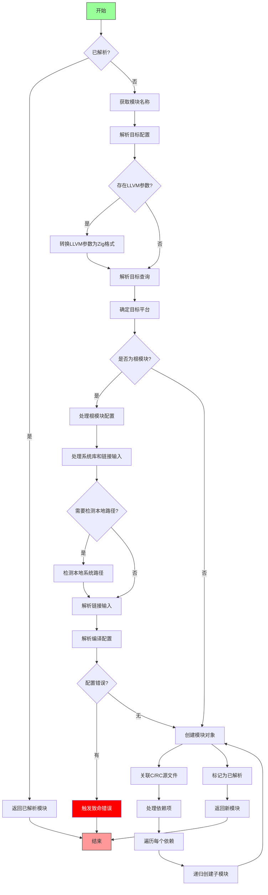

嗯，我现在需要帮用户用Mermaid画出一个Zig函数的流程图。这个函数看起来挺复杂的，首先我需要仔细阅读代码，理解它的结构和逻辑流程。

首先，函数名是createModule，看起来是用来创建模块的。参数有很多，包括分配器、创建模块的结构体、索引、父模块等等。函数返回一个模块或者错误。

接下来，函数一开始检查cli_mod.resolved是否存在，如果存在就直接返回。否则，继续处理。这里应该是一个条件判断，如果已经解析过就直接返回。

然后，获取模块的名字，接着处理目标平台相关的逻辑。这里有一个大块是关于target_parse_options的设置，包括架构、CPU特性等等。如果存在llvm_m_args，需要处理这些参数，转换成Zig风格的CPU特性。这部分可能涉及到循环处理每个参数，构建mcpu_buffer，并更新target_parse_options。

之后，使用parseTargetQueryOrReportFatalError解析目标查询，获取目标信息。这部分可能会有错误处理，比如解析失败时触发致命错误。

接下来，如果parent为空，说明是根模块，需要处理更多的配置选项，比如链接库、系统路径、框架目录等。这里有很多条件判断和循环，比如处理链接输入，检查系统库，处理libc路径，处理Windows库等。

然后，处理链接输入，解析库路径，处理系统库的检测，特别是针对不同平台（如Windows、Darwin）的特殊处理。这里可能有很多分支，比如是否是本地系统，是否需要检测本地路径等。

之后，处理libc安装路径，解析libc路径文件，或者查找本地安装。这部分可能有错误处理，比如找不到libc时的致命错误。

接着，解析链接输入，处理动态库、静态库等，并设置相关选项。这部分可能涉及到遍历链接输入，分类处理。

然后，使用Compilation.Config.resolve来解析配置选项，这里有很多可能的错误情况，需要处理各种错误并触发致命错误。

最后，创建模块对象Package.Module.create，处理可能的错误，设置模块的依赖关系，递归处理子模块的创建。

整个函数的流程应该是：检查是否已解析→解析目标配置→如果是根模块处理配置→解析链接库和路径→创建模块→处理依赖的子模块。

现在，我需要将这些步骤转化为Mermaid的流程图。需要注意条件判断、循环、错误处理以及各个步骤之间的顺序。可能需要使用不同的形状，如菱形表示条件判断，矩形表示处理步骤，平行四边形表示输入输出，圆形表示开始结束等。

可能的结构如下：

开始 → 检查cli_mod.resolved是否存在？是→返回m；否→继续
→ 获取模块名
→ 处理目标配置（包括转换LLVM参数、解析目标查询）
→ 如果是根模块（parent为null），处理各种配置选项（链接库、系统路径、libc等）
→ 解析链接输入
→ 解析配置选项（Compilation.Config.resolve）
→ 创建模块对象
→ 处理C源文件和RC源文件
→ 处理依赖，递归创建子模块
→ 返回模块

其中，处理目标配置部分可能有子流程，比如处理LLVM参数转换。根模块的处理部分也有很多子步骤，需要详细展开。

需要确保流程图的逻辑正确，尤其是条件分支和循环部分。同时，错误处理部分可能用致命错误终止流程，所以可能不需要在流程图中详细画出每个错误，而是用终止节点表示。

可能还需要考虑函数中的递归调用，处理依赖模块的部分，但流程图可能需要简化这部分，避免过于复杂。

现在，根据以上分析，画出Mermaid流程图。
================================================

流程说明：
1. 起始后首先检查模块是否已解析
2. 未解析时进行目标平台配置解析（含LLVM参数转换）
3. 根模块需要处理系统库路径检测、链接输入解析等复杂逻辑
4. 配置解析阶段包含错误处理分支
5. 创建模块对象后处理源文件关联和依赖项递归创建
6. 最终返回新建模块或已缓存模块
7. 红色节点表示错误终止路径
8. 绿色节点为开始，红色节点为结束

注：为保持可读性，部分复杂子流程（如LLVM参数转换、路径检测等）未完全展开，实际实现中这些步骤包含多层嵌套逻辑。