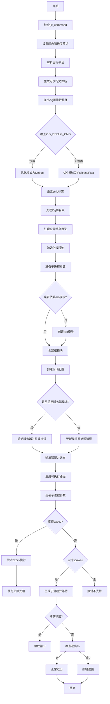

嗯，我需要为这个Zig函数`jitCmd`画一个流程图。首先，我得仔细阅读代码，理解它的执行流程。这个函数看起来是用来处理JIT编译命令的，涉及到了编译配置、模块创建、进程生成等步骤。

首先，函数开始时会检查`dev.check(.jit_command)`，可能是用于开发调试的检查点。接下来设置颜色和进度节点，这部分可能用于控制输出颜色和进度显示。然后处理目标查询，解析目标平台信息，生成可执行文件的名称。

接着，函数尝试找到Zig的可执行路径，并根据环境变量设置优化模式和是否剥离符号。然后处理Zig库目录和全局缓存目录的路径，可能会打开或创建这些目录。

之后，初始化线程池，用于并发处理。然后准备子进程的参数，构建子进程的命令行参数。这里涉及到了模块的创建，包括根模块和可能的`aro`模块的依赖处理。然后创建编译配置，处理错误，如果有服务器模式的话，启动服务器处理输出，否则更新模块。

最后，生成子进程，处理执行结果，如果有错误则退出，否则根据子进程的退出状态决定是否成功。

我需要把这些步骤分解成流程图中的各个节点，并确定它们之间的逻辑关系，比如条件判断、循环、错误处理等。比如，在设置优化模式时有一个条件判断，根据环境变量选择Debug或ReleaseFast。还有处理依赖模块`aro`的条件判断。另外，执行子进程时有不同的情况，比如是否支持execv，是否捕获输出等。

可能需要注意的错误处理部分，比如在打开目录或创建模块时，如果有错误会调用`fatal`并退出。这部分应该在流程图中用条件分支表示。

总之，我需要将整个函数的逻辑分解成顺序步骤、条件分支、并行处理（如线程池）、子进程生成等部分，并用mermaid的流程图语法表示出来。可能需要简化一些细节，保持流程图的可读性。
================================================

流程说明：
1. 从初始化检查和环境配置开始
2. 通过多级条件判断处理编译模式、模块依赖和运行模式
3. 最终通过不同方式执行子进程（execv/spawn）
4. 处理子进程执行结果并实现退出控制
5. 错误处理贯穿整个流程，关键步骤失败会调用fatal终止
6. 包含编译配置、模块加载、进程生成三个核心阶段