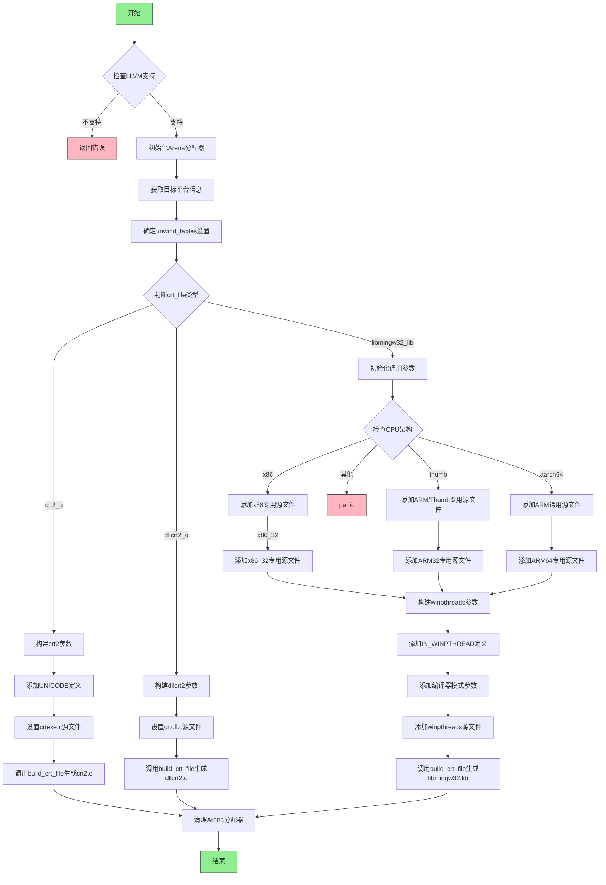

嗯，我需要为这个Zig函数`buildCrtFile`画一个流程图。首先，我得理解这个函数的结构和逻辑流程。让我先通读一遍代码。

函数开始检查`build_options.have_llvm`，如果没有的话返回错误。然后初始化一个Arena分配器，获取目标平台的信息，确定unwind_tables的设置，根据不同的`crt_file`类型处理不同的情况。

接下来是三个主要的case：`.crt2_o`、`.dllcrt2_o`和`.libmingw32_lib`。每个case里都会构建不同的参数，添加不同的源文件，然后调用`comp.build_crt_file`。特别是第三个case，`.libmingw32_lib`，处理更复杂，根据不同的CPU架构添加不同的源文件，还有处理winpthreads的参数。

流程图需要涵盖这些条件分支和循环结构。比如，在`.libmingw32_lib`中，有多个for循环遍历不同的源文件列表，还有条件判断不同的CPU架构。我需要确保这些逻辑在流程图中正确表示。

可能需要注意的是，函数中有多个错误处理点，比如`try`语句，但流程图中通常不展示错误返回的路径，除非特别重要。此外，初始化arena和defer语句可能在流程图中作为初始步骤和结束步骤。

我应该从函数入口开始，按照代码执行的顺序，画出各个条件分支和循环。使用不同的节点表示条件判断、循环、函数调用等。同时，每个case分支下的处理流程需要详细展开，尤其是第三个case中的复杂逻辑。

可能遇到的挑战是如何简洁地表示多个循环和条件嵌套，同时保持流程图的可读性。可能需要使用子流程或者分组来处理复杂的部分，比如`.libmingw32_lib`中的不同架构处理。

最后，确保所有步骤都被正确连接，逻辑流程清晰，没有遗漏重要的判断或步骤。
================================================

流程图说明：
1. 起始节点检查LLVM支持，失败直接返回错误
2. 成功初始化内存分配器后进入核心逻辑
3. 根据crt_file类型分三个主要分支：
   - crt2_o：处理应用程序启动代码
   - dllcrt2_o：处理DLL启动代码
   - libmingw32_lib：处理核心运行时库（包含复杂架构判断）
4. libmingw32_lib分支包含嵌套的架构判断和多个循环添加源文件的过程
5. 所有路径最终都会执行资源清理并结束流程
6. 红色节点表示错误/异常路径，绿色节点表示开始/结束节点