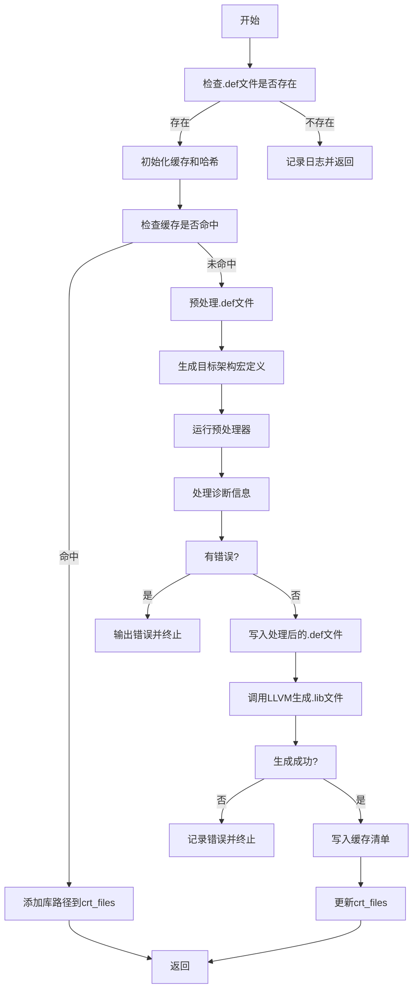

嗯，我现在需要帮用户用Mermaid画出他们提供的Zig函数的流程图。首先，我得仔细阅读这段代码，理解它的逻辑流程。这个函数叫buildImportLib，看起来是用来生成DLL的导入库的。让我先大致看一下函数的步骤。

首先，函数开始进行一些初始化操作，比如检查开发模式，创建arena分配器，然后尝试找到对应的.def文件。如果找不到，就记录日志并返回。如果找到，继续处理。接着设置目标平台，初始化缓存，添加各种前缀路径，然后生成哈希值。之后检查缓存是否存在，如果命中，就直接使用缓存中的库文件，否则继续处理。

然后，处理.def文件，使用预处理器（可能是aro库）来处理宏和包含目录，生成最终的.def文件。接着调用LLVM的WriteImportLibrary来生成.lib文件，最后更新缓存和crt_files。

接下来，我需要把这些步骤分解成流程图中的各个节点。需要注意条件判断和循环，比如错误处理部分，以及缓存是否命中的分支。同时，函数中有多个错误处理和资源释放（如defer语句），这些是否需要在流程图中体现呢？可能需要简化，突出主要流程。

可能的步骤分解：
1. 开始
2. 检查是否有.def文件，没有则返回
3. 初始化缓存和哈希
4. 检查缓存是否命中
5. 命中则添加路径并返回
6. 未命中则预处理.def文件，生成新的.lib
7. 写入缓存，更新crt_files
8. 结束

需要注意的是，在预处理过程中可能出现的错误处理，比如AroPreprocessorFailed，应该在流程图中体现为错误分支。此外，涉及到的文件操作和LLVM调用也需要作为步骤。

可能的结构：

开始 -> 检查.def文件是否存在？不存在则记录并返回，存在则继续。
初始化缓存 -> 添加哈希 -> 检查缓存命中？
命中：添加路径到crt_files，返回。
未命中：预处理.def文件，生成lib文件 -> 写入缓存 -> 添加路径到crt_files -> 返回。

可能还需要处理错误情况，比如在预处理或写入库失败时的错误处理分支，但用户可能希望流程图是主要成功路径，错误处理用条件判断框表示。

现在，我需要把这些步骤转化为Mermaid的流程图语法，使用正确的节点和箭头连接，同时处理条件分支。
================================================
