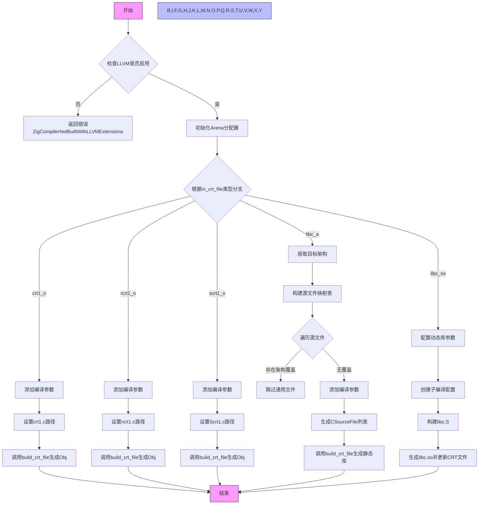

嗯，我现在需要帮用户用Mermaid画出一个Zig函数的流程图。这个函数是buildCrtFile，看起来是关于构建C运行时文件的。首先，我得理解这个函数的结构和逻辑流程。

首先，函数开始检查是否启用了LLVM扩展，如果没有就返回错误。然后初始化一个Arena分配器，根据输入的CrtFile类型处理不同的情况。有四种情况：crt1_o、rcrt1_o、scrt1_o、libc_a、libc_so。每种情况都会构建不同的文件，比如Obj文件或者静态库、动态库。

对于每个case，比如crt1_o，会添加编译参数，指定源文件路径，然后调用comp.build_crt_file。而libc_a的情况更复杂，需要处理不同架构的源文件，检查是否存在特定架构的覆盖文件，然后生成对应的CSourceFile列表。libc_so部分涉及创建子编译配置，设置各种参数，最后生成动态库。

我需要将整个流程分解成各个步骤，用条件判断来区分不同的情况。每个case对应不同的处理流程，特别是libc_a和libc_so部分比较复杂，需要详细展开。可能需要用分支结构来表示switch中的各个情况，然后每个分支内的处理步骤作为子流程。

要注意函数中的错误处理和资源管理，比如defer语句释放资源，但流程图可能不需要详细展示这些，主要关注主要逻辑流程。另外，函数的返回点需要标明，比如每个case最后都会return comp.build_crt_file或者处理libc_so后的操作。

可能的结构是：

开始 -> 检查LLVM -> 初始化Arena -> 根据in_crt_file分支 -> 各个case处理 -> 构建文件 -> 结束。

每个case内部的具体步骤需要详细展开，例如添加参数、处理源文件、调用构建函数等。对于libc_a，可能需要循环处理源文件，检查覆盖路径。这部分可能需要循环结构，但Mermaid的流程图可能用子流程或注释节点来表示。

可能遇到的挑战是如何简洁地表示复杂的逻辑，特别是循环和条件判断。可能需要使用子图（subgraph）来组织各个case的处理流程，保持主流程的清晰。

现在，我需要根据这些分析画出Mermaid流程图，确保每个分支都被正确表示，步骤清晰，逻辑正确。
================================================
