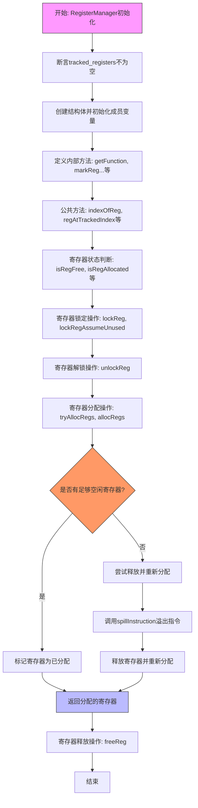

嗯，用户让我用mermaid画一个Zig函数的流程图。首先，我需要理解这个函数的结构和逻辑。这个函数叫做RegisterManager，看起来是管理寄存器的，包括分配、释放、锁定等操作。首先，我应该通读整个代码，了解各个部分的作用。

首先，函数接收三个参数：Function、Register和tracked_registers。然后返回一个结构体，里面包含各种方法和状态。结构体里有registers、free_registers、allocated_registers和locked_registers这几个成员变量。接下来有很多方法，比如markRegAllocated、markRegUsed、indexOfReg、tryAllocRegs等。

流程图需要展示整个函数的逻辑流程。可能需要分几个部分：初始化、分配寄存器、释放寄存器、锁定和解锁寄存器，以及错误处理等。每个方法之间可能有调用关系，比如tryAllocRegs会调用markRegAllocated和markRegUsed。

我应该先画出主结构，即RegisterManager的创建过程，然后分步骤画出各个方法的调用流程。注意条件判断，比如在tryAllocRegs中检查是否有足够的空闲寄存器，如果没有则返回null。还有allocRegs中的错误处理，可能会抛出OutOfRegisters错误。

另外，有些方法是公共的（pub），有些是私有的（fn），需要确定在流程图中是否需要包含私有方法。用户可能希望整体流程，所以可能需要包括主要的公共方法及其调用关系。

可能还需要考虑循环和条件分支，比如在tryAllocRegs中使用迭代器遍历空闲寄存器，直到找到足够的数量。这时候在流程图中需要用条件判断和循环结构来表示。

最后，确保流程图清晰，每个步骤之间有正确的连接线，标注条件判断的结果路径。可能需要使用不同的形状，比如矩形表示步骤，菱形表示判断，平行四边形表示输入/输出等。

总结一下步骤：
1. 分析代码结构，确定主要功能模块。
2. 确定各个方法之间的调用关系和流程。
3. 绘制主流程，包括初始化、寄存器分配、释放、锁定等。
4. 添加条件判断和循环结构。
5. 检查流程图是否覆盖所有主要逻辑，确保准确性。
================================================
