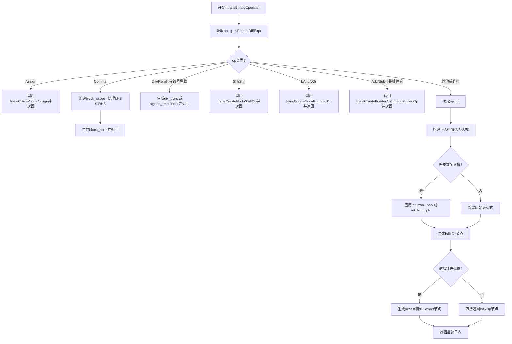

好，我需要为这个Zig函数画一个流程图。首先，我得理解这个函数的结构和逻辑。函数名为transBinaryOperator，看起来是处理二元操作符的转换。让我先大致看一下代码。

函数开始获取操作符op和类型qt，然后根据不同的op进入不同的处理分支。首先是Assign和Comma的情况，然后是Div、Rem、Shl、Shr等操作符。每个case有不同的处理逻辑，比如Comma会创建一个块作用域，处理左右表达式，最后返回块节点。对于Div和Rem，如果是带符号整数，会调用特定的Zig函数如@divTrunc或std.zig.c_translation.signedRemainder。

接下来是处理Add、Sub的情况，当涉及指针运算时会有特殊处理。然后是其他操作符，如比较操作符，位操作符等，每个对应到不同的Zig标签。最后处理左右表达式，可能进行类型转换，然后生成对应的中缀操作节点。如果是指针差运算，还需要进行额外的处理，比如位转换和大小计算。

现在需要将这些逻辑转化为流程图。流程图应该从函数入口开始，根据op的不同分支到不同的处理步骤。每个case需要画出对应的判断和处理流程，比如Assign直接返回赋值节点，Comma处理左右表达式并生成块，Div和Rem的条件判断等。接着处理其他操作符，确定op_id，然后处理左右表达式，可能的类型转换，最后生成节点并处理指针差的情况。

需要注意的是条件判断的流程，比如检查是否是带符号整数，是否是指针运算等。每个分支结束后可能有不同的返回路径。另外，有些操作符可能进入默认处理流程，通过switch确定op_id后统一处理。

在画流程图时，应该用菱形表示判断，矩形表示处理步骤，箭头连接流程。例如，开始→判断op类型→不同的处理分支→生成对应节点→返回结果。对于指针差的情况，需要额外的步骤如位转换和sizeof计算。

可能需要将整个流程分解成几个主要部分：处理特定操作符（如Assign、Comma等），处理算术操作符（如Add、Sub、Mul等），处理比较和位操作符，最后处理左右表达式和类型转换，以及指针差的特殊情况。

需要确保每个判断分支都覆盖到，比如op的各种可能值，以及条件检查如cIsSignedInteger、qualTypeIsPtr等。同时，注意错误处理和内存管理部分，比如defer block_scope.deinit()，但在流程图中可能不需要详细体现这些细节，主要关注主逻辑流。

最后，整合所有分支，确保流程图的连贯性和准确性，可能需要多次检查代码逻辑，确保每个case和条件都正确反映在流程图中。
================================================

流程说明：
1. 入口获取操作符类型和类型信息
2. 通过多层条件判断处理特殊操作符（赋值/逗号/位移等）
3. 对通用操作符进行op_id映射
4. 处理左右操作数并执行必要的类型转换
5. 对指针减法运算进行特殊处理（bitcast和sizeof计算）
6. 最终返回生成的AST节点