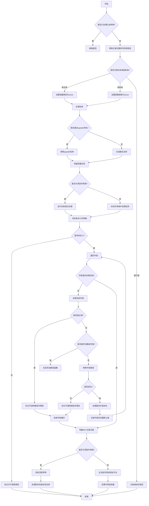

嗯，我需要用Mermaid画这个Zig函数的流程图。首先，我得理解这个函数的结构。这个函数`transRecordDecl`的作用是处理C的结构体或联合体声明，转换为Zig的代码。看起来它有很多条件判断和循环，可能需要分步骤来画。

首先，函数开始检查是否已经处理过这个声明，如果有就直接返回。然后获取记录的位置和顶层作用域信息。接着确定是联合体还是结构体，如果不是其中之一则报错。然后处理名称，如果是未命名的结构体或联合体，生成一个名称。之后处理字段，包括位域、匿名字段和灵活数组字段的情况。如果有不支持的字段类型，会将结构体降级为不透明类型。最后构建AST节点，并根据作用域添加到顶层或当前作用域。

我需要把这些步骤分解成流程图中的各个节点。注意条件判断和循环，比如检查是否是结构体或联合体，处理字段的循环，以及可能的错误处理路径。另外，需要考虑不同情况下的分支，例如是否是顶层作用域、是否有未命名的情况等。

可能遇到的难点是如何正确表示循环和条件分支，特别是处理字段时的循环。需要确保每个分支都有正确的流向，包括错误处理和正常流程。同时，处理名称生成和别名的情况也需要在流程图中体现出来。

可能还需要注意函数中的一些细节，比如`try`语句的错误处理，这可能会影响流程的分支。例如，当`transQualType`返回错误时，会进入错误处理路径，导致结构体被降级为不透明类型。

总之，我需要将整个函数的逻辑步骤拆解，用Mermaid的流程图语法表示出来，确保每个判断和循环都有正确的节点和连接线，同时处理错误和特殊情况的分支。
================================================
