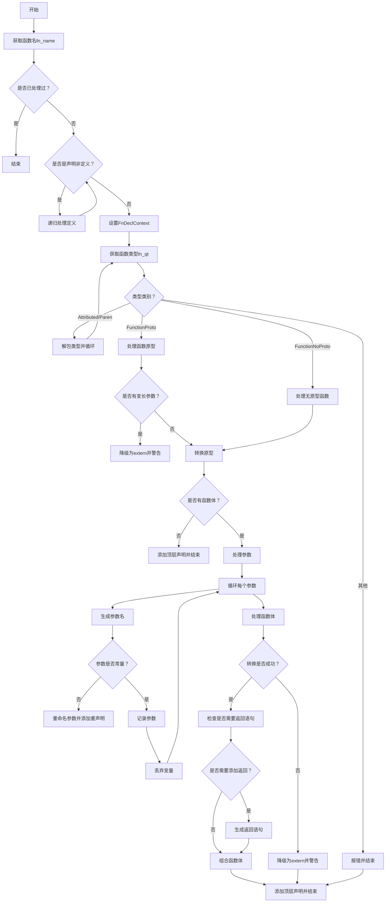

嗯，我需要为这个用 Zig 写的函数画一个流程图。首先，我得仔细看看这个函数是做什么的。函数名是 visitFnDecl，看起来是处理函数声明的。让我先通读代码，理解每个部分的作用。

首先，函数开始获取函数名，并检查是否已经处理过，如果有的话就直接返回。这部分应该是一个判断框，如果是的话就结束处理。然后检查是否是声明而非定义，如果是的话则递归处理定义部分。这里可能需要一个循环或条件分支。

接下来是处理函数的存储类、是否有内联属性等，设置一些上下文变量。这部分可能对应几个流程步骤，比如判断存储类，处理错误情况等。

然后处理函数的类型，包括返回类型和参数类型。这里有一个循环，不断解包类型直到得到基本类型，比如处理属性类型和括号类型。这部分可能需要一个循环结构在流程图中。

之后根据函数类型是否是原型函数（FunctionProto）或者无原型函数（FunctionNoProto）进行处理，这里会有不同的分支，可能对应不同的处理函数，比如 transFnProto 和 transFnNoProto。如果有错误，比如不支持的类型，就会跳转到错误处理。

如果函数没有主体（has_body为假），就直接添加到顶层声明。否则，处理函数体，包括参数的处理，生成参数名，处理常量性，以及可能的变量重命名。这部分可能涉及多个步骤，比如循环处理每个参数，生成对应的变量名，处理重声明等。

接着处理函数体中的语句，转换复合语句。如果转换失败，同样会将函数降级为 extern。最后，检查是否需要添加返回语句，特别是当函数没有返回语句时，自动生成一个返回零值的语句。这部分可能需要条件判断，比如函数是否无返回，返回类型是否是 anyopaque 等。

整个流程中，错误处理和降级到 extern 的情况需要特别注意，可能需要多个错误处理的路径。此外，递归调用 visitFnDecl 处理定义的情况也需要在流程图中体现出来。

现在，我需要把这些步骤转化为流程图的结构。使用 Mermaid 的流程图语法，从开始到结束，每个条件判断用菱形框，处理步骤用矩形框，错误处理和返回用不同的路径。需要注意循环结构，比如处理类型的循环可能需要一个循环节点，或者用条件判断来表示继续解包类型。

可能的结构如下：

1. 开始
2. 获取函数名
3. 检查是否已处理过，是则结束
4. 检查是否是声明非定义，是则递归处理定义
5. 设置函数声明上下文（存储类、内联等）
6. 处理函数类型（循环解包类型）
7. 根据函数类型分支处理原型或无原型
8. 如果没有函数体，添加到声明并结束
9. 处理函数参数（循环每个参数）
10. 处理函数体语句
11. 检查是否需要添加返回语句
12. 添加到顶层声明
13. 错误处理路径，降级为 extern 并添加声明

在流程图中需要将这些步骤连接起来，处理条件分支和错误路径。可能需要使用子流程或分组来组织复杂的部分，比如参数处理和函数体处理。

现在，根据这些步骤，用 Mermaid 语法绘制流程图，注意正确的节点和箭头连接，条件判断的分支，以及错误处理的路径。
================================================

这个流程图描述了函数`visitFnDecl`的主要处理步骤，包括：  
1. 检查是否已处理过，避免重复。  
2. 处理声明与定义的关系。  
3. 解析函数类型（支持嵌套类型解包）。  
4. 处理函数原型或旧式声明。  
5. 处理参数名、重命名非`const`参数。  
6. 转换函数体，处理错误时降级为`extern`。  
7. 自动补全返回语句（若需要）。  
8. 最终添加到顶层声明。  

菱形节点表示条件分支，矩形节点表示操作步骤，红色路径为错误处理分支。