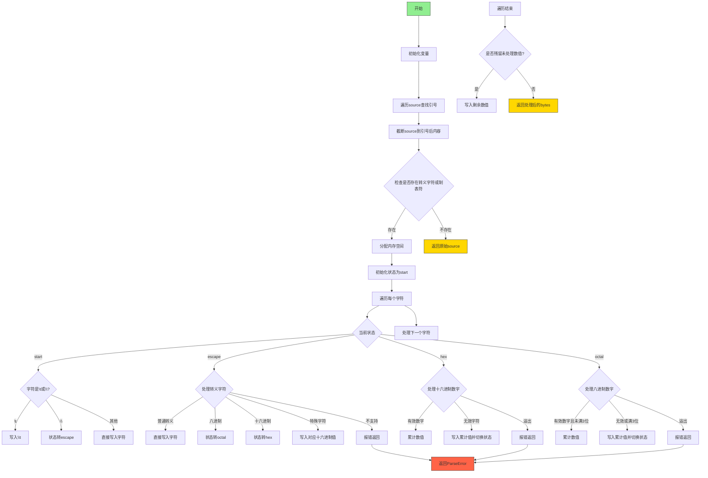

好的，我现在需要为给定的Zig函数`zigifyEscapeSequences`绘制一个流程图。首先，我得仔细理解这个函数的功能和结构。函数看起来是处理字符串中的转义序列，将其转换为Zig兼容的格式。

首先，我会通读代码，了解大致流程。函数接收一个上下文`ctx`和宏上下文`m`，然后处理输入的字符串`source`。主要逻辑分为几个状态：start、escape、hex、octal，这些状态用于处理不同的转义情况。

接下来，我需要确定每个状态之间的转换条件。例如，当在`start`状态遇到反斜杠`\`时，会转换到`escape`状态。在`escape`状态下，根据不同的字符（如'n', 'x', '0'-'7'等），进入不同的处理路径，比如hex或octal状态。

然后，处理hex和octal状态时，需要收集足够的数字字符，并将其转换为相应的十六进制或八进制表示。过程中还要处理可能的溢出错误，并通过`m.fail`报告错误。

此外，函数还处理特殊字符如制表符`\t`，将其转换为`\\t`。对于不支持的转义序列（如Unicode的`\u`或`\U`），会抛出错误。

在绘制流程图时，需要将这些状态和转换条件清晰地表示出来。可能需要使用不同的节点表示各个状态，并用箭头表示状态之间的转换，同时标注触发转换的条件或字符。

还需要注意循环结构，例如主循环遍历`source`中的每个字符，根据当前状态进行处理。此外，错误处理部分也需要在流程图中体现，比如当遇到无法处理的转义序列时，流程会终止并返回错误。

最后，需要确保流程图的逻辑与代码完全一致，没有遗漏任何重要的步骤或条件。可能需要在绘制完成后，再次对照代码检查每个步骤是否正确反映在流程图中。
================================================

流程图说明：
1. 初始化后先定位到第一个引号后的内容
2. 检查是否存在需要处理的转义字符
3. 使用状态机处理四种状态：
   - start：初始状态，处理普通字符和转义起始
   - escape：处理转义字符的映射
   - hex：处理十六进制数值
   - octal：处理八进制数值
4. 每个状态根据输入字符进行状态转移和数值处理
5. 最终处理未完成的数值写入并返回结果
6. 错误处理贯穿整个流程，遇到非法字符立即终止