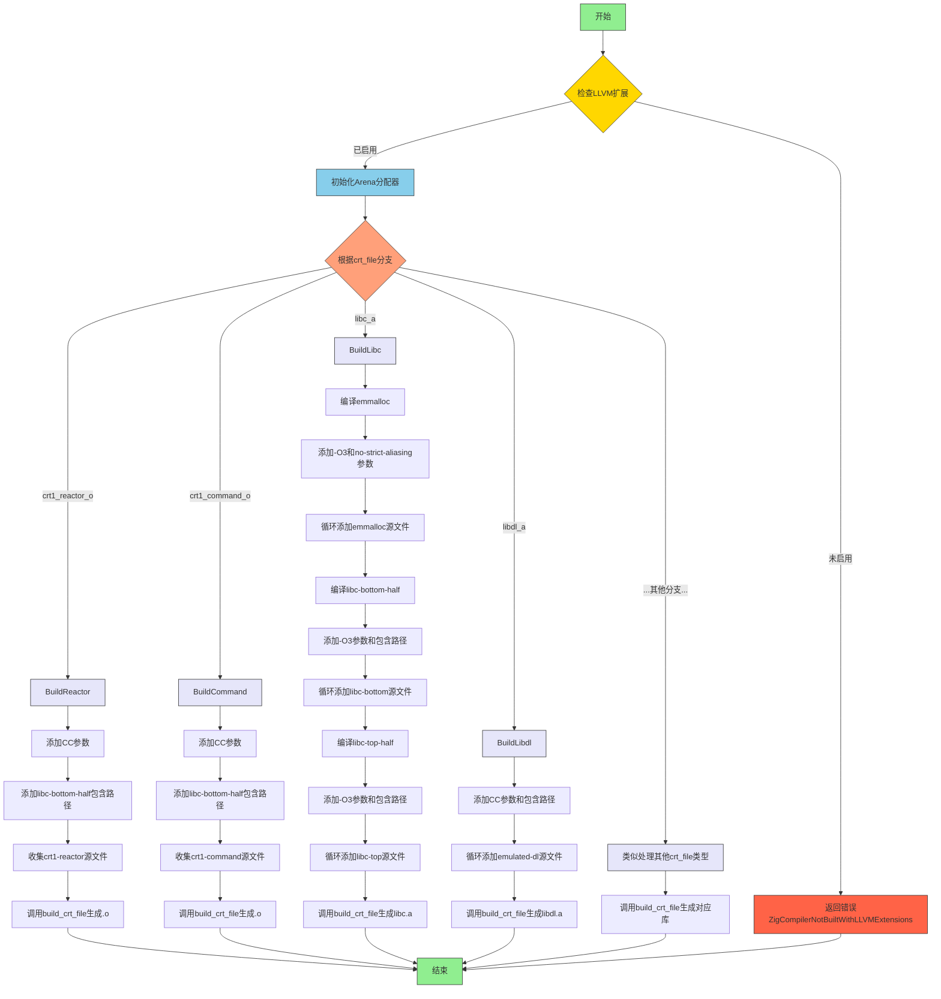

嗯，我需要为提供的Zig函数`buildCrtFile`画一个流程图。首先，我得仔细阅读并理解这个函数的结构和逻辑。函数主要根据不同的`crt_file`类型执行不同的编译步骤。看起来这是一个构建WASI相关库和对象的函数。

首先，函数开始检查是否启用了LLVM扩展，如果没有，就返回错误。然后初始化一个Arena分配器，用于临时内存分配。接下来是一个大的switch语句，根据`crt_file`的不同值处理不同的情况，比如`.crt1_reactor_o`、`.crt1_command_o`、`.libc_a`等。

每个case里会构建不同的编译参数，添加包含路径，收集源文件，然后调用`comp.build_crt_file`来生成对应的目标文件或库。例如，`.libc_a`的情况涉及编译emmalloc、libc-bottom-half和libc-top-half的源代码，每个部分可能有不同的编译选项。

我需要把这些逻辑分支转化为流程图。每个case对应一个分支，每个分支内的步骤包括初始化参数列表、添加编译参数、收集源文件、调用构建函数等。需要注意的是，有些case里还有子步骤，比如`.libc_a`分为编译emmalloc、libc-bottom-half和libc-top-half三个部分，每个部分可能有循环添加多个源文件。

可能的流程结构大致如下：

1. 开始
2. 检查LLVM扩展，失败则返回错误
3. 初始化Arena分配器
4. 根据crt_file的不同进入不同分支
   - 每个分支处理特定的构建任务
   - 每个分支内可能包含多个步骤，如参数设置、添加源文件等
5. 调用comp.build_crt_file生成目标文件或库
6. 结束

需要注意条件判断、循环处理源文件的部分，以及不同case之间的独立性。另外，错误处理（如try语句）在流程图中可能需要表示为可能的错误出口，但根据函数签名，错误会被传递出去，所以可能不需要特别标注，除非有特定的错误处理逻辑。

在转换为Mermaid流程图时，每个case作为不同的分支，用条件判断节点分开。每个分支内的步骤按顺序排列，循环处理源文件可以用循环节点表示，或者简化为一个步骤，因为具体循环次数可能由数组长度决定。

可能需要简化一些细节，比如具体的参数添加过程，而专注于主要步骤，如初始化参数、添加包含目录、收集源文件、调用构建函数等。保持流程图清晰易懂是关键，避免过于复杂。
================================================

流程图说明：
1. **逻辑分支**：通过菱形节点表示条件判断（如LLVM检查、crt_file类型分支）
2. **模块化处理**：每个crt_file类型对应独立处理流程，用不同颜色区分
3. **关键操作**：
   - 参数配置（CC参数、包含路径）
   - 源文件收集（循环添加多个源文件）
   - 最终构建调用（build_crt_file）
4. **错误处理**：红色节点表示错误出口
5. **简化表示**：省略部分重复细节（如其他分支的详细步骤），用"..."表示类似逻辑